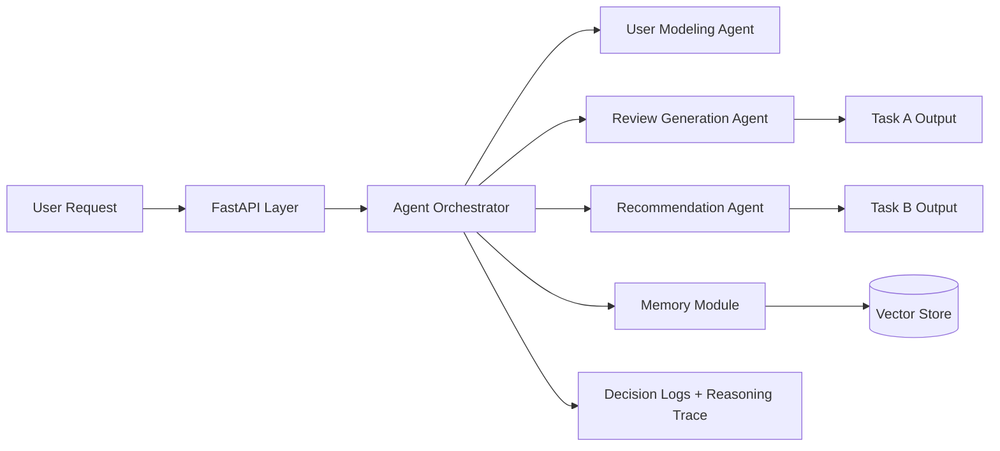
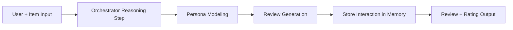
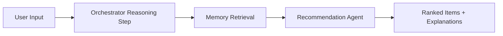

# NaijaSense AI

NaijaSense AI is a context-aware, multi-agent backend that:

- simulates realistic user reviews (Task A),
- recommends relevant items with memory + reasoning (Task B),
- exposes transparent agent decisions through FastAPI APIs.

## Why This Can Win

- **Nigerian flavor** in review generation for culturally grounded outputs.
- **Transparent orchestration** with reasoning steps and decision logging.
- **Evaluation-ready** metrics for both generation and recommendation quality.
- **Demo-ready delivery** with Docker + compose startup.

## Architecture Diagram



## Agent Workflow

### Task A: Review Simulation



Flow:
1. Orchestrator plans Task A path.
2. Persona is inferred from user context.
3. Review is generated in persona tone (including Nigerian style when selected).
4. Output is saved to memory for future recommendations.

### Task B: Recommendation



Flow:
1. Orchestrator plans retrieval-first strategy.
2. Relevant behavior history is retrieved from vector memory.
3. Candidate items are ranked with explanations.

## Nigerian Flavor Strategy

The review agent supports expressive local tone for `nigerian_twitter` personas:

- Positive style example: `Omo this one slap!`
- Negative style example: `This place no try at all`
- Balanced style example: `Omo, I don test am and e dey okay sha`

This keeps outputs natural, culturally familiar, and demo-friendly.

## Tech Stack

- Python 3.10+
- FastAPI
- Modular multi-agent architecture
- Vector memory (in-memory now, Chroma/FAISS-ready)
- Docker + Docker Compose

## Project Structure

```text
.
├── agents/                 # User modeling, review generation, recommendation agents
├── api/                    # FastAPI app and routes
├── core/                   # Central orchestrator logic
├── memory/                 # Vector store and user memory manager
├── models/                 # LLM wrappers/abstractions
├── evaluation/             # Evaluation metrics and runners
├── scripts/                # CLI scripts (evaluation, utilities)
├── data/                   # Sample datasets
├── tests/                  # API tests
├── utils/                  # Config, logger, shared schemas
├── Dockerfile
├── docker-compose.yml
├── main.py
├── requirements.txt
└── README.md
```

## API Endpoints

- `GET /api/v1/health`
- `POST /api/v1/simulate-review`
- `POST /api/v1/recommend`

## How To Run

### Local

```bash
pip install -r requirements.txt
uvicorn main:app --reload
```

Docs:
- [http://localhost:8000/docs](http://localhost:8000/docs)

### Docker

```bash
docker build -t naijasense-ai .
docker run --rm -p 8000:8000 naijasense-ai
```

### Docker Compose

```bash
docker compose up --build
```

## Demo Payloads (Judge Friendly)

### Simulate Review

```bash
curl -X POST "http://localhost:8000/api/v1/simulate-review" \
  -H "Content-Type: application/json" \
  -d '{
    "user_profile": {
      "user_id": "u_demo_1",
      "location": "Lagos",
      "interests": ["food", "lifestyle"],
      "sentiment_bias": "positive"
    },
    "item_data": {
      "item_name": "Amala Spot",
      "item_context": "Service was fast and the meal was fresh."
    },
    "persona_style": "nigerian_twitter"
  }'
```

### Recommend

```bash
curl -X POST "http://localhost:8000/api/v1/recommend" \
  -H "Content-Type: application/json" \
  -d '{
    "user_profile": {
      "user_id": "u_demo_1",
      "location": "Lagos",
      "interests": ["food", "tech"],
      "sentiment_bias": "balanced"
    },
    "candidate_items": ["Foodie Hub", "Budget Earbuds", "Formal Shoes"],
    "context": "I want practical options for daily life",
    "top_k": 2
  }'
```

## Evaluation Module

Run benchmark metrics for both tasks:

```bash
python scripts/run_evaluation.py --dataset data/sample_evaluation_dataset.json --k 10
```

Included metrics:

- Task A: ROUGE / BERTScore / RMSE
- Task B: NDCG@10 / Hit Rate@10

## Running Tests

```bash
pytest -q
```

## Scalability Notes

- Replace `InMemoryVectorStore` with FAISS/Chroma adapter in `memory/vector_store.py`.
- Replace deterministic `LLMWrapper` with OpenAI/local model client in `models/llm_wrapper.py`.
- Add async task queue (Celery/RQ) for heavy inference workloads.
- Add persistent DB for production-grade user profile storage.

