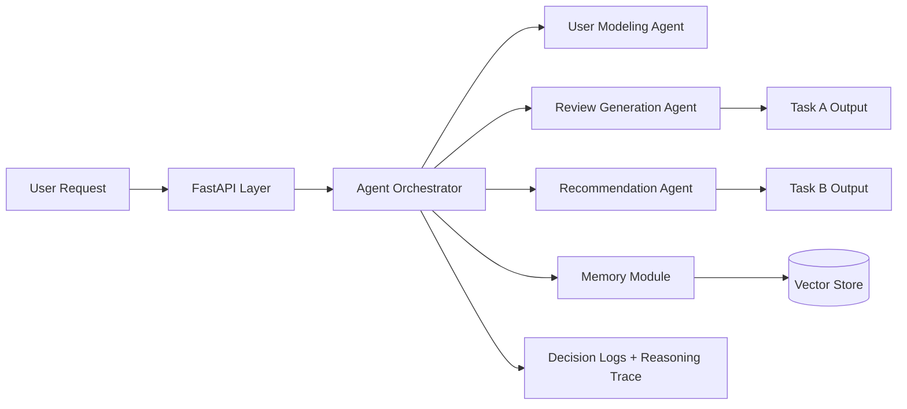
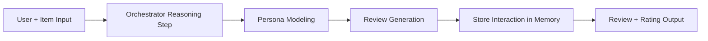
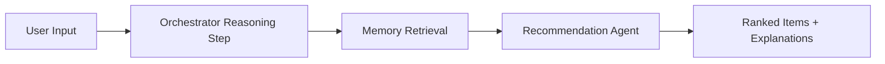

# NaijaSense AI

NaijaSense AI is a context-aware, multi-agent backend that:

- simulates realistic user reviews (Task A),
- recommends relevant items with memory + reasoning (Task B),
- exposes transparent agent decisions through FastAPI APIs.

## Why This Can Win

- **Nigerian flavor** in review generation for culturally grounded outputs.
- **Transparent orchestration** with reasoning steps and decision logging.
- **Evaluation-ready** metrics for both generation and recommendation quality.
- **Demo-ready delivery** with Docker + compose startup.

## Architecture Diagram



## Agent Workflow

### Task A: Review Simulation



Flow:
1. Orchestrator plans Task A path.
2. Persona is inferred from user context.
3. Review is generated in persona tone (including Nigerian style when selected).
4. Output is saved to memory for future recommendations.

### Task B: Recommendation



Flow:
1. Orchestrator plans retrieval-first strategy.
2. Relevant behavior history is retrieved from vector memory.
3. Candidate items are ranked with explanations.

## Nigerian Flavor Strategy

The review agent supports expressive local tone for `nigerian_twitter` personas:

- Positive style example: `Omo this one slap!`
- Negative style example: `This place no try at all`
- Balanced style example: `Omo, I don test am and e dey okay sha`

This keeps outputs natural, culturally familiar, and demo-friendly.

## Tech Stack

- Python 3.10+
- FastAPI
- Modular multi-agent architecture
- Vector memory (in-memory; **Chroma** included in Docker Compose for persistence / future LangChain RAG)
- LangChain orchestration for `/api/agent/v1` (OpenAI or Groq when configured)
- Docker + Docker Compose (API + Next.js frontend + Chroma)

## Project Structure

```text
.
├── agents/                 # User modeling, review generation, recommendation agents
├── api/                    # FastAPI app and routes
├── core/                   # Central orchestrator logic
├── memory/                 # Vector store and user memory manager
├── models/                 # LLM wrappers/abstractions
├── evaluation/             # Evaluation metrics and runners
├── scripts/                # CLI scripts (evaluation, utilities)
├── data/                   # Sample datasets
├── tests/                  # API tests
├── utils/                  # Config, logger, shared schemas
├── Dockerfile
├── docker-compose.yml
├── main.py
├── requirements.txt
└── README.md
```

## API Endpoints

- `GET /api/v1/health`
- `POST /api/v1/simulate-review`
- `POST /api/v1/recommend`
- `POST /api/agent/v1` — **unified gateway**: JSON body `user_persona` + `query`; LangChain (or heuristic) routes to Task A or B. See `.env.example` for `ORCHESTRATOR_PROVIDER`, `OPENAI_API_KEY`, `GROQ_API_KEY`.

### Unified chat UI

```bash
cd frontend && npm install && npm run dev
```

Open [http://localhost:3000/unified](http://localhost:3000/unified). Set `NEXT_PUBLIC_AGENT_API_URL` if the API is not on `http://127.0.0.1:8000/api/agent/v1`.

## How To Run

### Local

```bash
pip install -r requirements.txt
uvicorn main:app --reload
```

Docs:
- [http://localhost:8000/docs](http://localhost:8000/docs)

### Docker

```bash
docker build -t naijasense-ai .
docker run --rm -p 8000:8000 naijasense-ai
```

### Docker Compose (API + frontend + Chroma)

```bash
docker compose up --build
```

- **API:** [http://localhost:8000](http://localhost:8000) (Swagger: `/docs`)
- **Frontend:** [http://localhost:3000/unified](http://localhost:3000/unified)
- **Chroma:** [http://localhost:18000](http://localhost:18000) (HTTP API; optional client wiring)

Optional LLM routing: create a `.env` next to `docker-compose.yml` with `ORCHESTRATOR_PROVIDER=groq` and `GROQ_API_KEY=...` (or `openai` + `OPENAI_API_KEY`). If unset, routing uses fast **heuristics** (tests stay offline).

## Demo Payloads (Judge Friendly)

### Simulate Review

```bash
curl -X POST "http://localhost:8000/api/v1/simulate-review" \
  -H "Content-Type: application/json" \
  -d '{
    "user_profile": {
      "user_id": "u_demo_1",
      "location": "Lagos",
      "interests": ["food", "lifestyle"],
      "sentiment_bias": "positive"
    },
    "item_data": {
      "item_name": "Amala Spot",
      "item_context": "Service was fast and the meal was fresh."
    },
    "persona_style": "nigerian_twitter"
  }'
```

### Recommend

```bash
curl -X POST "http://localhost:8000/api/v1/recommend" \
  -H "Content-Type: application/json" \
  -d '{
    "user_profile": {
      "user_id": "u_demo_1",
      "location": "Lagos",
      "interests": ["food", "tech"],
      "sentiment_bias": "balanced"
    },
    "candidate_items": ["Foodie Hub", "Budget Earbuds", "Formal Shoes"],
    "context": "I want practical options for daily life",
    "top_k": 2
  }'
```

## Evaluation Module

Run benchmark metrics for both tasks:

```bash
python scripts/run_evaluation.py --dataset data/sample_evaluation_dataset.json --k 10
```

Included metrics:

- Task A: ROUGE / BERTScore / RMSE
- Task B: NDCG@10 / Hit Rate@10

## Real Dataset Pipeline (Yelp / Amazon / Goodreads-ready)

Build a normalized corpus (JSONL) for retrieval-grounded generation:

```bash
python scripts/build_review_corpus.py --output data/processed/review_corpus.jsonl --limit 500 --use_hf
```

**Kaggle (CSV mirrors / community splits):** datasets are free, but Kaggle still expects a **logged-in account** to download (browser or API)—there is no anonymous bulk URL. You do **not** have to use the API: unzip a manual download and point the script at it, or let the API fill `data/raw/kaggle/<owner>_<name>/` once; after that, cached CSVs are read **without** calling `kaggle` again.

API automation (optional): [create a Kaggle API token](https://www.kaggle.com/docs/api), save `kaggle.json` under `~/.kaggle/` (Windows: `C:\Users\<you>\.kaggle\kaggle.json`), accept each dataset’s rules on the website if prompted, then:

```bash
pip install -r requirements.txt
python scripts/build_review_corpus.py --output data/processed/review_corpus.jsonl --limit 500 --use_kaggle
```

Manual download (no API): unzip so one or more `.csv` files sit in a folder, then:

```bash
python scripts/build_review_corpus.py --use_kaggle --kaggle_sources amazon --kaggle_amazon_dir path/to/unzipped_folder --limit 500
```

Use `--kaggle_sources amazon` or `yelp` to pull only one source; override slugs with `--kaggle_amazon_slug` / `--kaggle_yelp_slug` if you switch datasets. Defaults point at community CSVs (`yacharki/amazon-reviews-for-sa-binary-negative-positive-csv`, `luisfredgs/yelp-reviews-csv`); column names are detected flexibly.

Notes:
- `--use_hf` attempts to ingest public HuggingFace datasets (`yelp_review_full`, `amazon_polarity`).
- `--extra_jsonl` loads pre-normalized lines with no Hub or Kaggle (see `data/offline_review_samples.jsonl`).
- Goodreads normalization is supported via schema adapters in `data_pipeline/normalize.py`.
- Backend reads `data/processed/review_corpus.jsonl` and retrieves similar examples during review generation.

## Competition Readiness Checklist

- Task A API/Web flow available (persona + item -> review + rating) ✅
- Task B API/Web flow available (persona -> recommendations) ✅
- Cold-start handling in recommendation scoring ✅
- Cross-domain scoring signal and explainability ✅
- Multi-turn conversational context support (`conversation_history`) ✅
- Dataset normalization pipeline (Yelp/Amazon/Goodreads-ready) ✅
- Evaluation scripts (ROUGE/BERTScore/RMSE/NDCG/HitRate + fidelity helper) ✅
- Solution paper template available at `docs/SOLUTION_PAPER_TEMPLATE.md` ✅

## Running Tests

```bash
pytest -q
```

## Scalability Notes

- Replace `InMemoryVectorStore` with FAISS/Chroma adapter in `memory/vector_store.py`.
- Replace deterministic `LLMWrapper` with OpenAI/local model client in `models/llm_wrapper.py`.
- Add async task queue (Celery/RQ) for heavy inference workloads.
- Add persistent DB for production-grade user profile storage.

