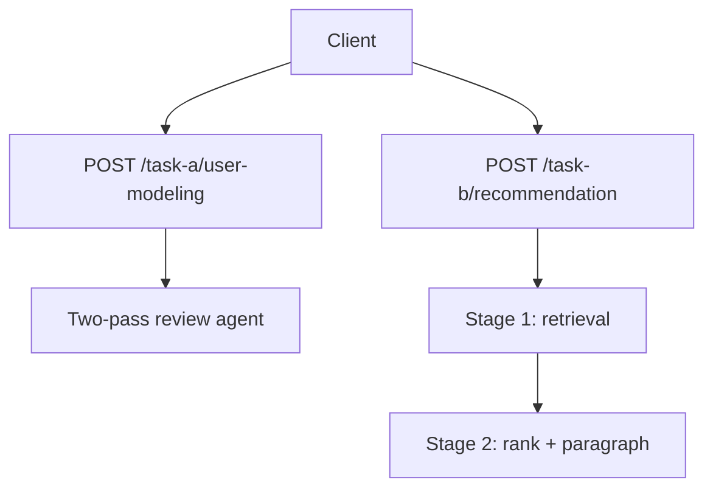

# NaijaSense AI

Behavioral intelligence for Nigerian lifestyle contexts: **Task A** (persona-conditioned reviews) and **Task B** (persona-only recommendations), plus an optional unified demo hub.

**Team:** TAOTECH SOLUTIONS · **Paper:** [`docs/SOLUTION_PAPER.md`](docs/SOLUTION_PAPER.md)

---

## Live endpoints

| | URL |
|--|-----|
| App | [naija-sense-ai.vercel.app](https://naija-sense-ai.vercel.app/) |
| Task A API | `POST` [/task-a/user-modeling](https://naija-sense-ai.vercel.app/task-a/user-modeling) |
| Task B API | `POST` [/task-b/recommendation](https://naija-sense-ai.vercel.app/task-b/recommendation) |
| Task A / B UI | [/task-a](https://naija-sense-ai.vercel.app/task-a) · [/task-b](https://naija-sense-ai.vercel.app/task-b) |
| Unified demo | [/unified](https://naija-sense-ai.vercel.app/unified) |

| Task | Input | Output |
|------|--------|--------|
| **A — User modeling** | `user_persona`, `product_details` (strings) | `rating`, `review_reasoning`, `review_text` |
| **B — Recommendation** | `user_persona`: `{ user_id, persona }` | `recommendations` (paragraph), `agent_reasoning` |

Stack: Groq **Llama 3.1 8B** (router) + **Llama 3.3 70B** (generator). Set `GROQ_API_KEY` and `ORCHESTRATOR_PROVIDER=groq` in production.

---

## How it works

**Task A** — Two-pass agent: infer domain → lock rating + rationale → write review text aligned to that score.

**Task B** — Persona-only pipeline: retrieve top-30 candidates from the **5k-row** shared corpus index → diversify by domain → router ranks items → generator writes one grounded paragraph.

**Unified hub** (`/unified`) — Optional demo: intent routing, streaming traces, silent history, critique loop. Not used on the hackathon submission routes.



Details: [`docs/SOLUTION_PAPER.md`](docs/SOLUTION_PAPER.md) · Deploy: [`docs/DEPLOYMENT.md`](docs/DEPLOYMENT.md)

---

## Quick start

**Prerequisites:** Python 3.11+, Node 20+ (or Docker 24+).

```bash
git clone https://github.com/taotechs/NaijaSense-AI.git
cd NaijaSense-AI
cp .env.example .env   # add GROQ_API_KEY
docker compose up --build
```

| Service | URL |
|---------|-----|
| UI | http://localhost:3000 |
| API docs | http://localhost:8000/docs |
| Health | http://localhost:8000/api/v1/health |

**Local dev:** `pip install -r requirements.txt`, `PYTHONPATH=.` + `uvicorn main:app --reload`; in `frontend/`, `npm install && npm run dev`.

**Smoke test:** `python scripts/smoke_api.py http://127.0.0.1:8000`

---

## API examples

**Task A**

```bash
curl -X POST "http://localhost:8000/task-a/user-modeling" \
  -H "Content-Type: application/json" \
  -d '{"user_persona":"Lagos foodie in Yaba, balanced tone.","product_details":"Iya Eba Amala Spot — lunch for two, amala soft, egusi rich, about 2k each, 20 min wait."}'
```

**Task B**

```bash
curl -X POST "http://localhost:8000/task-b/recommendation" \
  -H "Content-Type: application/json" \
  -d '{"user_persona":{"user_id":"demo_user","persona":"UNILAG student in Yaba on a 10k weekly budget. Loves jollof, street food, and weekend Nollywood."}}'
```

Other routes (`/api/v1/*`, `/api/agent/v1`, streaming) are documented in Swagger and [`docs/DEPLOYMENT.md`](docs/DEPLOYMENT.md).

---

## Data & corpus

**One corpus for Task A and Task B:** `data/processed/review_corpus.jsonl` (**5,011** rows — Yelp 2,498 · Amazon 2,482 · Goodreads 31).

Task A uses it for few-shot retrieval; Task B uses the same file via `data/processed/corpus_index.json` (built at deploy / locally).

**Build or refresh the index:**

```bash
python scripts/build_corpus_index.py
```

**Rebuild review_corpus.jsonl** (optional — Hugging Face or offline):

```bash
python scripts/build_review_corpus.py --use_hf --hf_sources yelp,amazon \
  --limit 2500 --extra_jsonl data/offline_review_samples.jsonl
python scripts/build_corpus_index.py --force
```

---

## Evaluation

```bash
pytest -q
python scripts/run_real_benchmark.py --sample_size 20 --all_variants
python scripts/eval_fidelity.py --base-url http://127.0.0.1:8000 --limit 20
```

Metrics and methodology: [`docs/EVAL.md`](docs/EVAL.md) · Results: [`data/benchmark_results.json`](data/benchmark_results.json)

---

## Configuration

| Variable | Purpose |
|----------|---------|
| `ORCHESTRATOR_PROVIDER` | `groq`, `openai`, or `none` |
| `GROQ_API_KEY` | Groq API key |
| `TASK_B_RERANK_PROVIDER` | `groq` (default), `gemini`, or `auto` |
| `TASK_B_TOP_K` | Recommendations ranked (default `6`) |

See `.env.example` for the full list.

---

## Project layout

```text
agents/          Task A & B pipelines
api/             FastAPI routes
core/            Orchestrator, corpus index, persona parsing
frontend/        Next.js UI
scripts/         Corpus generation, benchmarks, smoke tests
docs/            Solution paper, deployment, evaluation guides
evals.py         Hackathon KPI helpers
```

---

## Docs

- [Solution paper](docs/SOLUTION_PAPER.md)
- [Deployment](docs/DEPLOYMENT.md)
- [Evaluation](docs/EVAL.md)
