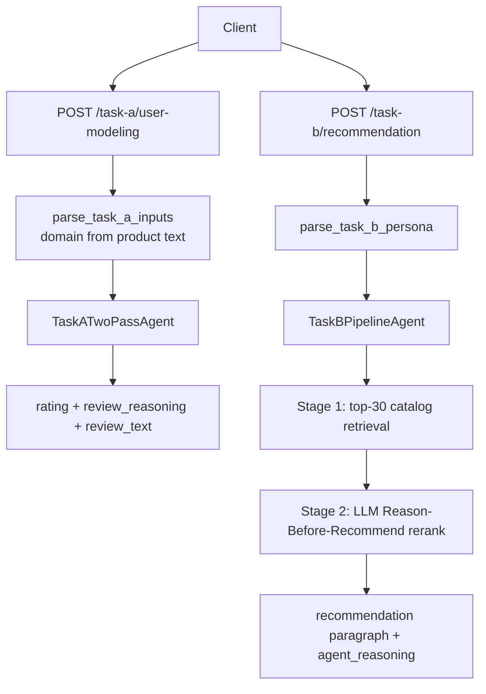
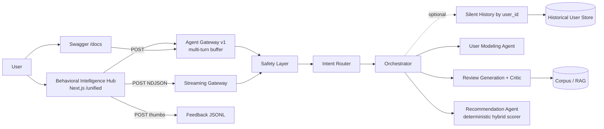

# NaijaSense AI · Behavioral Intelligence Hub

**Team:** TAOTECH SOLUTIONS

## Hackathon submission (dual-link)

Use these **two separate URLs** in the DSN × BCT submission form:

| Task | Method | Endpoint | Input | Output |
|------|--------|----------|-------|--------|
| **Task A — User modeling** | `POST` | `/task-a/user-modeling` | `user_persona` + `product_details` (strings) | `rating`, `review_reasoning`, `review_text` |
| **Task B — Recommendation** | `POST` | `/task-b/recommendation` | `user_persona`: `{ user_id, persona }` only | `recommendations` (paragraph) + `agent_reasoning` |

**Live submission URLs** (Vercel proxies POST to Koyeb — redeploy both tiers after pulling latest `main`).

> **Vercel env:** leave `NEXT_PUBLIC_API_BASE_URL` **unset**. If it points at Koyeb, the demo UI calls Koyeb from the browser and shows “backend unreachable” or 404. Only `NEXT_PUBLIC_AGENT_API_URL` is required (for `/unified` and rewrites).

| Field | URL |
|-------|-----|
| App / landing | [https://naija-sense-ai.vercel.app/](https://naija-sense-ai.vercel.app/) |
| Task A | [https://naija-sense-ai.vercel.app/task-a/user-modeling](https://naija-sense-ai.vercel.app/task-a/user-modeling) |
| Task B | [https://naija-sense-ai.vercel.app/task-b/recommendation](https://naija-sense-ai.vercel.app/task-b/recommendation) |
| Task A demo UI | [https://naija-sense-ai.vercel.app/task-a](https://naija-sense-ai.vercel.app/task-a) |
| Task B demo UI | [https://naija-sense-ai.vercel.app/task-b](https://naija-sense-ai.vercel.app/task-b) |
| Interactive demo | [https://naija-sense-ai.vercel.app/unified](https://naija-sense-ai.vercel.app/unified) |
| Backend (direct) | [https://youthful-wynn-taotechs-6715c87e.koyeb.app](https://youthful-wynn-taotechs-6715c87e.koyeb.app) |

**Evaluation module:** `evals.py` at repo root (RMSE, ROUGE, BERTScore fallback, NDCG@10, Hit Rate@10, cold-start helpers).

---

NaijaSense AI ships **two submission POST endpoints** (Task A & Task B) plus a **Behavioral Intelligence Hub** (`/unified`) for demos, streaming traces, and ablations.

- **Task A (submission):** two-pass user modeling — Pass 1 locks a domain-aware star rating + rationale; Pass 2 writes first-person `review_text` aligned to that score (`TaskATwoPassAgent`).
- **Task B (submission):** persona-only input — stage-1 corpus retrieval (top 30) then LLM **Reason-Before-Recommend** rerank with mandatory `agent_reasoning` (`TaskBPipelineAgent`).
- **Unified hub (demo):** intent router → orchestrator with silent history by `user_id`, critique→regenerate on reviews, and legacy deterministic ranking on `/api/v1/recommend` (benchmark path).

The stack **separates a fast router model from a strong generator** (Groq Llama 3.1 8B + Llama 3.3 70B), grounds Task A in corpus few-shots/RAG, and documents both paths honestly in [`docs/SOLUTION_PAPER.md`](docs/SOLUTION_PAPER.md).

<p align="center">
  
</p>

> **Live demo:** <https://naija-sense-ai.vercel.app/unified> · **API:** <https://youthful-wynn-taotechs-6715c87e.koyeb.app/api/v1/health>

---

## Project highlights

- **Honest, reproducible benchmarks.** Ablation numbers in [`data/benchmark_results.json`](data/benchmark_results.json) measured on a held-out slice of Yelp + Goodreads + Amazon reviews, plus a behavioural-fidelity A/B harness ([`scripts/eval_fidelity.py`](scripts/eval_fidelity.py), [`docs/EVAL.md`](docs/EVAL.md)) that quantifies how much the silent history step moves the needle.
- **Streaming agentic UX.** The unified gateway has a non-blocking NDJSON streaming sibling (`POST /api/agent/v1/stream`) that emits each reasoning step as it fires; the UI renders them as an animated timeline so the agent's thinking is visible in real time.
- **Transparent reasoning.** Every response carries `reasoning_steps`, `safety_flags`, `timing_ms`, the routing path, and the critique-pass verdict — all surfaced in the UI as pills, badges, and an expandable trace.
- **Multi-language output.** A `language` field on the persona supports `english`, `pidgin`, and `yoruba_mix`, threaded into the generator prompt as a hard rule that overrides the persona-style preset.
- **Two-model split.** Cheap router model (Groq Llama-3.1-8B) for classification + persona inference + safety critique; strong generator (Llama-3.3-70B) for writing. Cuts cost while keeping output quality high.
- **Advisory safety layer.** Input is scanned for prompt-injection + PII shapes; output is checked for PII leakage and ungrounded numeric specifics. Findings surface as a non-blocking `safety_flags` array, never as a hard block.
- **Feedback loop, built-in.** Thumbs-up / thumbs-down on every result writes to a JSONL log (`POST /api/agent/feedback`) so the team can audit outputs and feed the signal back as few-shot examples.
- **Nigerian contextualisation.** Persona styles support formal global English and `nigerian_twitter` (light pidgin colouring) with hard rules in the prompt to prevent forced slang.
- **Containerised** end-to-end (FastAPI + Next.js + Chroma) with one `docker compose up`, plus a public production deploy on **Koyeb (backend) + Vercel (frontend)**.

---

## Architecture

### Submission endpoints (Task A & Task B)



**Task A flow (`TaskATwoPassAgent`):**

1. Parse `user_persona` + `product_details` strings; infer **product domain** from product text (`core/task_a_inputs.py`).
2. **Pass 1 (router):** JSON `{ rating, review_reasoning }` with domain few-shots + optional corpus search (top 3).
3. **Pass 2 (generator):** first-person `review_text` with **rating locked** from Pass 1.

**Task B flow (`TaskBPipelineAgent`):**

1. Parse `user_persona.persona` only (no separate query/context field).
2. **Stage 1:** `retrieve_top_k` → up to 30 candidates (cold-start / cross-domain via `core/nigerian_defaults.py`).
3. **Stage 2:** Gemini returns `agent_reasoning` plus a single `recommendations` paragraph (flowing prose, no numbered list).

### Unified hub (demo + benchmarks)



**Unified hub only** — not used on `/task-a` or `/task-b`:

0. **Silent context retrieval** by `user_id` before routing (`HistoricalUserStore` → `UserMemory` + `HistoricalPersona`).
1. **Task A (orchestrator):** persona merge → RAG → generate → optional critique→regenerate → persist to memory.
2. **Task B (orchestrator):** multi-turn buffer → deterministic hybrid scorer (`0.5×interest + 0.25×memory + …`) → `chain_of_thought` in `explainability` (legacy `/api/v1/recommend` and ablation harness).

See [`docs/SOLUTION_PAPER.md`](docs/SOLUTION_PAPER.md) for the full submission vs demo split.

---

## How to run

> Prerequisites: **Python 3.11+**, **Node.js 20+**, and (for the container path) **Docker 24+ with Docker Compose v2**. A Groq API key (free tier works) or OpenAI key is recommended — without one the app falls back to deterministic heuristics.

> Going live? See [`docs/DEPLOYMENT.md`](docs/DEPLOYMENT.md) for a step-by-step Vercel (frontend) + Koyeb (backend) deploy, plus drop-in alternatives for Render, Fly.io, Hugging Face Spaces, and Railway. The repo ships with `koyeb.yaml`, `render.yaml`, and a `$PORT`-aware `Dockerfile` so the live deploy is essentially clone → connect → set env vars.

### Option A · Docker Compose (recommended)

Spins up the FastAPI backend, the Next.js Behavioral Intelligence Hub UI, and a Chroma vector store with one command:

```bash
git clone https://github.com/taotechs/NaijaSense-AI.git
cd NaijaSense-AI
cp .env.example .env            # then edit and add GROQ_API_KEY (or OPENAI_API_KEY)
docker compose up --build
```

When the containers are healthy:

| Service | URL |
|---|---|
| **Behavioral Intelligence Hub (UI)** | <http://localhost:3000> |
| Swagger / OpenAPI docs | <http://localhost:8000/docs> |
| Health probe | <http://localhost:8000/api/v1/health> |
| Chroma vector store | <http://localhost:18000> |

To stop: `docker compose down` (add `-v` to also drop the Chroma volume).

### Option B · Local dev (hot-reload)

Run the backend and frontend in two terminals. From the project root:

```bash
# Terminal 1 — FastAPI
python -m venv .venv
# Windows PowerShell:  .venv\Scripts\Activate.ps1
# macOS / Linux:       source .venv/bin/activate
pip install -r requirements.txt
cp .env.example .env             # add GROQ_API_KEY (or OPENAI_API_KEY)

# Windows PowerShell:
$env:PYTHONPATH = (Get-Location).Path
# macOS / Linux:
export PYTHONPATH=$(pwd)

python -m uvicorn main:app --host 127.0.0.1 --port 8000 --reload
```

```bash
# Terminal 2 — Next.js UI
cd frontend
npm install                       # first time only
npm run dev                       # serves http://localhost:3000
```

Open <http://localhost:3000> — the home route redirects to `/unified`, which is the Behavioral Intelligence Hub. Swagger lives at <http://localhost:8000/docs>.

### Using the UI

The Behavioral Intelligence Hub centralizes core interaction and observability features in one screen.

<p align="center">
  
</p>

1. **Single input field.** Placeholder: *"Simulate a review for a Nigerian spot or ask for personalized recommendations…"* — the LLM intent router decides between Task A and Task B automatically.
2. **Quick-start chips** with Nigerian context (Ikeja suya, late-night Yaba akara/noodles, Iya Eba jollof, Abuja-on-10k). One click fills the textarea.
3. **Output language selector.** Three options — *English*, *Nigerian Pidgin*, *English + Yoruba mix* — threaded into the generator as a hard prompt rule that overrides the persona-style preset.
4. **Behavioral profile (Task A user modeling).** A clearly labelled collapsible section with a **Quick preset** dropdown (Lagos foodie · VI lifestyle critic · Abuja professional · Campus student) plus manual fields for location, interests, sentiment bias, tone notes and history.
5. **Silent history toggle.** When checked (default), the silent corpus retrieval step runs before routing; uncheck only for experimentation. The hub always shows **one** answer per submission.
6. **Backend status pill.** A small pill in the page header pings `/api/v1/health` on mount (which doubles as a free-tier pre-warm) and polls every 60s. States: *checking → waking up… → ready · NNms → unreachable*.
7. **Live agent trace.** While the request streams, an animated timeline fills in step-by-step (silent retrieval → persona strategy → build persona → generate → critique / persist). Each node has its own icon and pulses while active, so the agent's reasoning is visible rather than implied.

<p align="center">
  
</p>

8. **Result card** — task pill (`Task A · review` or `Task B · recommend`), routing source (`llm` vs `heuristic`), language tag, `NNms` latency, an amber `Critique applied` chip when the critique→regenerate loop fired, and the orchestrator's rationale.
9. **Safety advisories.** Non-blocking flags from the validation layer surface as small amber chips with hover-tooltips (e.g. `prompt_injection_suspected`, `ungrounded_numeric_specifics`, `pii_phone_in_input`).
10. **Thumbs feedback.** Every result card carries 👍 / 👎 buttons that POST to `/api/agent/feedback` and append to a JSONL log for later audit + few-shot fine-tuning fuel.
11. **Agentic reasoning trace** — the same animated timeline, frozen on the final state, with the full numbered list of every reasoning line emitted by the orchestrator.

### Verify the stack in 30 seconds

```bash
# 1. Health probe (should return {"status": "ok"})
curl http://localhost:8000/api/v1/health

# 2. End-to-end smoke (review + recommend + critique scenarios)
python scripts/smoke_api.py http://127.0.0.1:8000
```

If both commands pass, the stack is functional end-to-end.

---

## Configuration (`.env`)

| Variable | Default | Purpose |
|---|---|---|
| `ORCHESTRATOR_PROVIDER` | `none` | `groq`, `openai`, or `none` (heuristic + deterministic fallback). |
| `GROQ_API_KEY` | — | Groq Cloud API key. |
| `GROQ_ROUTER_MODEL` | `llama-3.1-8b-instant` | Small/fast model for intent routing, persona inference, and review critique. |
| `GROQ_GENERATOR_MODEL` | `llama-3.3-70b-versatile` | Strong model for review writing. |
| `OPENAI_API_KEY` | — | Used only when `ORCHESTRATOR_PROVIDER=openai`. |
| `ORCHESTRATOR_MODEL` | `gpt-4o-mini` | OpenAI model name when OpenAI is selected. |
| `GEN_TEMPERATURE` | `0.85` | Generator sampling temperature. |
| `GEN_TOP_P` | `0.9` | Generator nucleus sampling. |
| `GEN_PRESENCE_PENALTY` | `0.6` | Discourages topic repetition. |
| `GEN_FREQUENCY_PENALTY` | `0.5` | Discourages token repetition. |
| `GEN_MAX_TOKENS` | `320` | Max tokens per generated review. |
| `REVIEW_CRITIQUE_ENABLED` | `true` | Toggles the critique → regenerate loop. |
| `REVIEW_CRITIQUE_THRESHOLD` | `4` | Specificity score (1–5) below which the review is rewritten. |
| `CHROMA_HOST` / `CHROMA_PORT` | — / `8000` | Optional Chroma service for persistent vector memory. |

---

## API endpoints

| Method | Path | What it does |
|---|---|---|
| `GET` | `/` | **Submission landing page** — HTML with links to Task A and Task B. |
| `POST` | `/task-a/user-modeling` | **Task A (hackathon).** Body: `user_persona` (string), `product_details` (string). |
| `POST` | `/task-b/recommendation` | **Task B (hackathon).** Body: `user_persona`: `{ user_id, persona }` only. |
| `GET` | `/api/v1/health` | Liveness probe; doubles as a cold-start pre-warm for the frontend. |
| `POST` | `/api/v1/simulate-review` | Task A — legacy explicit endpoint. Body: `user_profile`, `item_data`, `persona_style`. |
| `POST` | `/api/v1/recommend` | Task B — legacy explicit endpoint. Body: `user_profile`, `candidate_items`, `context`, `top_k`. |
| `POST` | `/api/agent/v1` | **Unified gateway.** Body: `user_persona`, `query`, `include_history?`, `compare_with_no_history?`. Routes to Task A or B via the LLM intent router (with heuristic fallback). |
| `POST` | `/api/agent/v1/stream` | **Streaming unified gateway.** Same payload as `/v1`, returns `application/x-ndjson` — one JSON event per line (`start` → `route` → `plan` → `step_start`/`step_end` × N → `final`). Powers the live reasoning timeline. |
| `POST` | `/api/agent/feedback` | Thumbs-up/down feedback. Appends to `data/feedback.jsonl`. |
| `GET` | `/api/agent/feedback/stats` | Aggregate over the feedback log (total / positive / negative / positive_pct). |

### New request fields on `/api/agent/v1` and `/v1/stream`

| Field | Type | Purpose |
|---|---|---|
| `user_persona.language` | `english` \| `pidgin` \| `yoruba_mix` | Hard language rule threaded into the generator prompt. Overrides `persona_style`. |
| `include_history` | `bool` (default `true`) | When `false`, skips the silent historical-context step. Useful for A/B isolation. |
| `compare_with_no_history` | `bool` (default `false`) | **Optional — not used by the public hub.** When `true` (and `include_history=true`), the API runs a second pass with history disabled and attaches it as `response.no_history_variant` (for scripts such as `scripts/eval_fidelity.py`). |

### New response fields

| Field | Type | Purpose |
|---|---|---|
| `safety_flags` | `string[]` | Advisory advisories: `prompt_injection_suspected`, `pii_email_in_input`, `ungrounded_numeric_specifics`, etc. Never blocking. |
| `timing_ms` | `int` | End-to-end server latency, surfaced as a UI pill. |
| `language` | `string` | The language actually used (after server-side normalisation). |
| `no_history_variant` | recursive `AgentGatewayResponse` | Present only when `compare_with_no_history=true` in the API request (eval / research use). The Behavioral Intelligence Hub does not request this field. |

### Example — Task A (hackathon)

```bash
curl -X POST "http://localhost:8000/task-a/user-modeling" \
  -H "Content-Type: application/json" \
  -d '{
    "user_persona": "Lagos-based foodie in Yaba, balanced reviewer. Cares about value-for-money, wait times, and authentic local taste.",
    "product_details": "Iya Eba Amala Spot — Saturday lunch with a friend. Amala was soft, egusi rich without too much oil, about 2k each, waited roughly 20 minutes."
  }'
```

### Example — Task B (hackathon)

```bash
curl -X POST "http://localhost:8000/task-b/recommendation" \
  -H "Content-Type: application/json" \
  -d '{
    "user_persona": {
      "user_id": "demo_user_2",
      "persona": "22-year-old UNILAG student in Yaba on a tight 10k weekly budget. Loves affordable street food, jollof spots, and weekend Nollywood with friends — value-for-money over luxury."
    }
  }'
```

### Example — unified gateway (optional demo)

```bash
curl -X POST "http://localhost:8000/api/agent/v1" \
  -H "Content-Type: application/json" \
  -d '{
    "user_persona": {
      "user_id": "demo_user",
      "location": "Lagos",
      "interests": ["street food", "amala"],
      "sentiment_bias": "balanced",
      "tone_notes": "Use Nigerian twitter tone.",
      "language": "pidgin"
    },
    "query": "Review for Iya Eba Amala Spot. Saturday lunch with a friend; amala was soft, egusi rich, 20 min wait, paid about 2k each.",
    "top_k": 4
  }'
```

The response includes `task`, `routing_source` (`llm` or `heuristic`), `review`/`recommendation`, `safety_flags`, `timing_ms`, `language`, and a `reasoning_steps` array including any critique-pass note.

### Example — streaming gateway (live reasoning)

```bash
curl -N -X POST "http://localhost:8000/api/agent/v1/stream" \
  -H "Content-Type: application/json" \
  -d '{ "user_persona": {"user_id":"demo_user", "language":"pidgin"},
        "query": "Suggest cheap weekend places to eat in Yaba." }'
```

The response is `application/x-ndjson` — one JSON object per line:

```jsonc
{"type":"start","ts":1747345560123}
{"type":"route","task":"recommend","source":"llm","rationale":"…"}
{"type":"plan","flow":"task_b_memory_recommendation","steps":["silent_context_retrieval", "…"]}
{"type":"step_start","flow":"task_b_memory_recommendation","step":"silent_context_retrieval"}
{"type":"step_end","flow":"task_b_memory_recommendation","step":"silent_context_retrieval"}
// …more step pairs…
{"type":"final","result": { /* full AgentGatewayResponse */ }}
```

The frontend parses these line-by-line and animates the reasoning timeline in real time.

---

## Datasets

The retrieval corpus at `data/processed/review_corpus.jsonl` represents **all three datasets named in the brief** (Yelp, Amazon, Goodreads). Build/rebuild with:

```bash
# HuggingFace path (recommended; needs internet)
python scripts/build_review_corpus.py \
  --output data/processed/review_corpus.jsonl \
  --extra_jsonl data/offline_review_samples.jsonl \
  --use_hf --hf_sources yelp,amazon --limit 250

# Fully offline path (uses curated seed only — useful for reproducibility)
python scripts/build_review_corpus.py \
  --output data/processed/review_corpus.jsonl \
  --extra_jsonl data/offline_review_samples.jsonl
```

A Kaggle path is also supported (`--use_kaggle` with API token, or `--kaggle_*_dir` for a manual unzipped download). See `scripts/build_review_corpus.py --help`.

Schemas are normalised through `data_pipeline/normalize.py`. The corpus we evaluated against in `data/benchmark_results.json` is:

| Source | Rows |
|---|---:|
| Yelp (HF + curated Nigerian restaurant seeds) | 274 |
| Goodreads (curated, including 20+ African-lit titles) | 31 |
| Amazon (curated tech/kitchen + HF when available) | 6 |
| **Total** | **311** |

> The HF `amazon_polarity` parquet was unreachable during our benchmark run; numbers reflect what was available. The pipeline supports the full slice when the endpoint is healthy.

---

## Evaluation

### Real-data benchmark with ablations

```bash
# Single variant
python scripts/run_real_benchmark.py --sample_size 20 --variant full --task both

# All variants (full / no_rag / no_critique / no_llm) — writes JSON report
python scripts/run_real_benchmark.py --sample_size 20 --all_variants --output data/benchmark_results.json
```

The harness:
- Samples N rows stratified by gold rating (positive / critical).
- **Task A:** generates a review from `item_name` only (gold review text is never shown) and scores against the gold via ROUGE-1/2/L, BERTScore (or token-F1 fallback), and RMSE on rating.
- **Task B:** builds a 20-item candidate set (target + 19 same-domain distractors) and scores NDCG@10 + Hit Rate@10.

> **BERTScore fallback note.** `bert-score` requires a torch build; on Python 3.14 wheels are unavailable and source builds time out. The evaluation module falls back to a token-F1 lexical proxy (clearly labelled `bertscore_mode=token-f1-fallback` in outputs). Real BERTScore can be enabled by installing `bert-score` in any Python ≤ 3.12 environment.

### Headline ablation findings

See `data/benchmark_results.json` for the full table. Highlights:

- **LLM is the dominant factor for Task A**: removing it drops ROUGE-1 by ~22% (0.161 → 0.126).
- **RAG slightly hurts ROUGE but helps diversity** (a classic lexical-metric blind spot): retrieved few-shots push the model toward more concrete, item-specific phrasings that don't necessarily share n-grams with gold.
- **Critique loop is metric-neutral on lexical scores** — by design, it targets human quality, not n-gram overlap.
- **Task B ablations** use the orchestrator's **deterministic** ranker (identical metrics across variants; Hit Rate@10 ≈ 0.2 vs ~0.5 random on hard same-domain distractors). The **submission** endpoint (`/task-b/recommendation`) adds LLM reranking over stage-1 candidates — use that path for evaluation, not the ablation harness alone.

### Behavioural fidelity (A/B history harness)

Quantifies how much the silent historical-context step moves the needle. For every eligible user (≥2 corpus entries) it holds out the last review and runs the agent twice — once with history, once without — then scores each generated review for rating error, TF cosine similarity, tone match, and a composite fidelity number.

```bash
# Against a locally running backend
python scripts/eval_fidelity.py --limit 20

# Against the deployed Koyeb backend
python scripts/eval_fidelity.py \
  --base-url https://youthful-wynn-taotechs-6715c87e.koyeb.app \
  --limit 30
```

Outputs go to `data/eval/`:

- `fidelity_results.jsonl` — per-sample raw scores for both modes.
- `fidelity_summary.json`  — aggregate means + the `delta` between modes.

Full methodology, metric definitions, and interpretation guide in [`docs/EVAL.md`](docs/EVAL.md).

### Smoke harnesses (quick checks)

```bash
# Calibration check: vague vs rich input, observe critique pass behaviour
python scripts/smoke_critique.py

# End-to-end HTTP smoke against a running API
python scripts/smoke_api.py http://127.0.0.1:8000
```

---

## Tests

```bash
pytest -q
```

6/6 currently passing on the main branch.

---

## Project layout

```text
.
├── agents/                  # task_a_two_pass, task_b_pipeline, orchestrator agents, critique loop
├── api/                     # FastAPI app + unified agent gateway route
├── core/                    # Orchestrator + LangChain intent router
├── data/                    # Processed corpus + benchmark results
├── data_pipeline/           # Normalisation schemas (Yelp / Amazon / Goodreads)
├── docs/                    # Solution paper (SOLUTION_PAPER.md) + template
├── evals.py                 # Hackathon KPI helpers (wraps evaluation/metrics.py)
├── evaluation/              # ROUGE / BERTScore-fallback / RMSE / NDCG / Hit Rate metrics
├── frontend/                # Next.js 15 unified chat UI
├── memory/                  # In-memory vector store + corpus store + user memory
├── models/                  # Role-aware LLM wrapper (router vs generator)
├── scripts/                 # Corpus builder, benchmark + ablation runner, smoke tests
├── tests/
├── utils/                   # Config, schemas, logger
├── Dockerfile / Dockerfile.frontend / docker-compose.yml
└── main.py
```

---

## Feature checklist

- ✅ Task A containerised app (API + Web)
- ✅ Task B containerised app (API + Web)
- ✅ Cold-start, cross-domain, multi-turn support
- ✅ Datasets normalisation for Yelp / Amazon / Goodreads (all represented in the eval corpus)
- ✅ Evaluation scripts with ROUGE / BERTScore (token-F1 fallback) / RMSE / NDCG@10 / Hit Rate@10
- ✅ Ablation runner (no-RAG / no-critique / no-LLM) with real numbers
- ✅ Behavioural-fidelity A/B harness ([`scripts/eval_fidelity.py`](scripts/eval_fidelity.py) + [`docs/EVAL.md`](docs/EVAL.md))
- ✅ Streaming reasoning gateway (`POST /api/agent/v1/stream`) + animated live timeline UI
- ✅ Multi-language output: English · Nigerian Pidgin · English + Yoruba mix
- ✅ Advisory safety / validation layer with `safety_flags` on every response
- ✅ User feedback loop (thumbs up/down → JSONL log + stats endpoint)
- ✅ Solution paper at [`docs/SOLUTION_PAPER.md`](docs/SOLUTION_PAPER.md) (submission PDF: `docs/TEAM TAOTECH SOLUTIONS SOLUTION_PAPER.pdf`)
- ✅ Reproducible Docker Compose stack
- ✅ Public production deploy: Vercel (frontend) + Koyeb (backend)
- ✅ Nigerian contextualisation in tone + retrieval seed data
