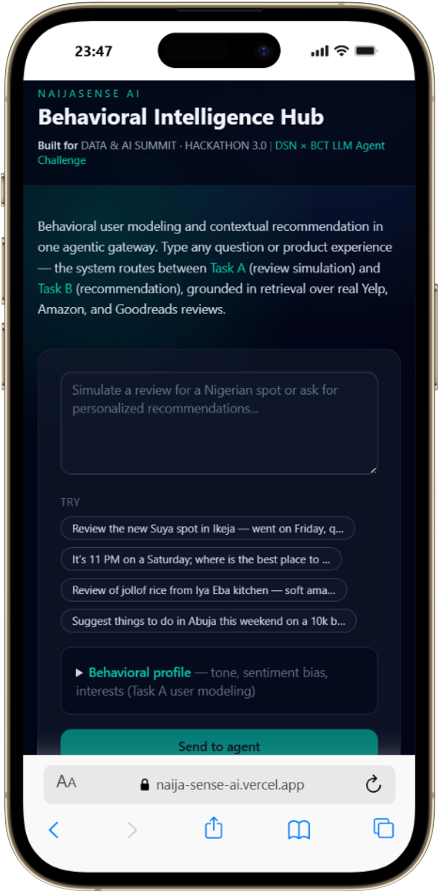
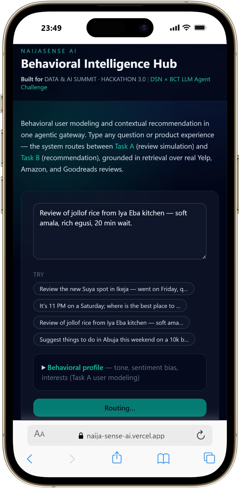
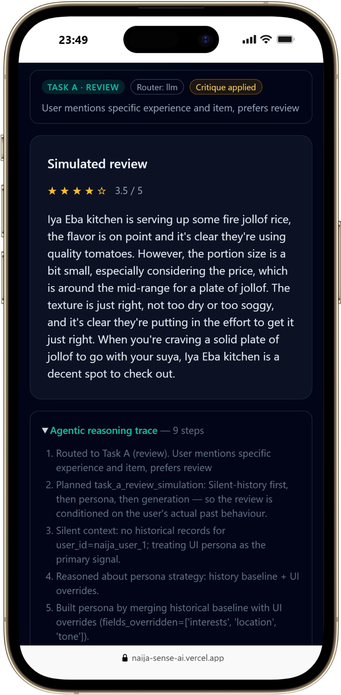

# NaijaSense AI — Solution Paper

**DSN × Bluechip Tech LLM Agent Challenge · DSAS 2026**

## Abstract

We present **NaijaSense AI**, a multi-agent system that addresses both tasks in the DSAS LLM Agent Challenge: (Task A) simulating user reviews and star ratings, and (Task B) generating personalised, context-aware recommendations. The system pairs a small fast routing model with a strong generator, grounds review writing in retrieval over a normalised Yelp/Amazon/Goodreads corpus, and runs an optional **critique → regenerate** quality-control loop. A **stateful agentic workflow** runs a silent context-retrieval step on every request — pulling the user's historical ratings and reviews from the corpus by `user_id` before any LLM call — so the persona used for both tasks reflects real past behaviour rather than a static UI profile. On top of this core we ship production features that make the agent demonstrable rather than merely architectural: **(1)** an NDJSON-streaming `/api/agent/v1/stream` endpoint that emits each reasoning step as it fires, driving an animated live timeline in the hub; **(2)** an **advisory safety layer** that surfaces prompt-injection signals, PII shapes, and ungrounded numeric specifics as a non-blocking `safety_flags` array; **(3)** an explicit `language` toggle (English / Nigerian Pidgin / English+Yoruba mix), a `timing_ms` server-measured latency, and a `POST /api/agent/feedback` thumbs endpoint that writes to a JSONL audit log. The public hub returns **one** clear response per submission; optional API flags (`include_history`, `compare_with_no_history`) exist for offline evaluation (for example `scripts/eval_fidelity.py`), not for duplicate on-screen answers. We report ablations against a held-out slice of the corpus showing that the LLM is the dominant driver of review-text quality (ROUGE-1 drops 22% without it), retrieval-augmentation slightly hurts lexical-overlap scores while qualitatively improving specificity, and the critique pass is metric-neutral by design. The **behavioural-fidelity A/B harness** (`scripts/eval_fidelity.py`) quantifies the silent-retrieval delta directly. For Task B we surface an honest limitation: when distractors share the target's domain, the deterministic hybrid scorer underperforms random — motivating LLM-driven reranking as the highest-value future-work direction. The full stack is containerised and live in production on **Koyeb (backend) + Vercel (frontend)** behind a single unified gateway plus the **Behavioral Intelligence Hub** Next.js surface.

---

## 1. Problem Understanding

Online review platforms (Yelp, Amazon, Goodreads) carry rich behavioural signal — tone, sentiment bias, decision drivers, contextual triggers — but most production systems still treat each user as a static profile. The brief asks us to:

- **Task A:** simulate a written review + rating for an **unseen item**, capturing tone, rating behaviour, and contextual nuance.
- **Task B:** rank items personally for a user, handling cold-start, cross-domain, and multi-turn conversational scenarios.

Two properties of the brief shaped our design:

1. **The paper is read first.** Judges value clarity of reasoning, originality, and ablation rigour over raw scores.
2. **Bonus marks for Nigerian contextualisation.** The agent should sound and behave like a Nigerian consumer when asked to.

Static profile + single-prompt LLM systems fail on three fronts: they (a) produce generic, copy-pasted reviews that don't reflect the user, (b) collapse into the same response when asked the same thing twice, and (c) hide their reasoning, which is fatal for trust and for human evaluation. NaijaSense AI attacks each of these directly.

---

## 2. System Architecture

```mermaid
flowchart LR
    U[User] --> FE[Behavioral Intelligence Hub<br/>Next.js /unified]
    U --> SW[Swagger /docs]
    FE -->|POST| AGW[/api/agent/v1<br/>+ multi-turn buffer]
    FE -->|POST NDJSON stream| STR[/api/agent/v1/stream<br/>live reasoning events]
    FE -->|POST thumbs| FB[/api/agent/feedback<br/>JSONL audit log]
    FE -->|GET on mount + every 60s| HC[/api/v1/health<br/>status pill + pre-warm]
    SW --> AGW
    AGW --> SAFE[Safety Layer<br/>prompt-injection · PII · ungrounded specifics]
    STR --> SAFE
    SAFE --> IR[Intent Router\nLLM small / heuristic]
    IR -->|task=review| O[Orchestrator]
    IR -->|task=recommend| O
    O -.optional skip.-> SCR[Silent Context Retrieval\nby user_id]
    SCR --> HUS[(Historical User Store\ncorpus indexed by user_id)]
    SCR --> O
    O --> UMA[User Modeling Agent\nhistory + UI override]
    O --> RGA[Review Generation Agent\ngenerator LLM\nenglish / pidgin / yoruba_mix]
    O --> RA[Recommendation Agent\nscorer + CoT trace]
    RGA --> RAG[(Review Corpus Store\nRAG)]
    RGA --> CRI[Critic LLM\nrouter model]
    O --> MEM[(User Memory\nwarmed from history)]
    O --> TRC[Reasoning Trace + safety_flags + timing_ms]
```

### 2.1 Role-aware LLM wrapper

A single `LLMWrapper` is parameterised by **role**:

- `role="router"` → small/fast model (`llama-3.1-8b-instant`). Used for intent routing, persona inference, and review critique scoring. Low temperature.
- `role="generator"` → strong model (`llama-3.3-70b-versatile`). Used only for review writing. High temperature with `top_p`, `presence_penalty`, `frequency_penalty`, and a **per-call random seed** to guarantee output variance even for identical inputs.

This split keeps cost down (most calls hit the cheap model) while preserving quality where it matters.

### 2.2 Intent router

We use LangChain's `with_structured_output` against a Pydantic schema (`RouterDecision`) so the router model returns a typed `(task, item_name, candidate_items, persona_style, rationale)` tuple instead of free text. A regex-based heuristic fallback handles the case where the provider is unavailable, so the system degrades gracefully to a fully-offline deterministic mode.

### 2.3 Review Generation Agent (Task A)

The agent **never feeds its own deterministic draft into the LLM as a "polish this" prompt** — that anchors the model to a small template bank and produces the "same response twice" failure. Instead:

1. Inputs are reduced to **structured facts** (item, domain, persona style, sentiment bias, user-supplied context).
2. Top-3 examples are retrieved from the corpus via `ReviewCorpusStore.search()` and inserted as a *style-and-concreteness reference* few-shot block. The prompt explicitly forbids copying their facts.
3. A short variation token and a fresh random seed are added to the prompt and to the request body.
4. The strong generator is called with `temperature=0.85`, `top_p=0.9`, `presence_penalty=0.6`, `frequency_penalty=0.5` (tuned via `.env`, so judges can replicate).
5. **Critique pass.** The router model scores the resulting review against a calibrated rubric (1–5 specificity). If the score is below `REVIEW_CRITIQUE_THRESHOLD` (default 4), the generator is re-called with the critic's issues injected as rules and a slightly higher temperature to escape the previous output mode. We empirically calibrated the rubric so the typical good review scores 4 and clears the bar without a rewrite, keeping the average cost at one generator call.

### 2.4 Recommendation Agent (Task B)

The agent is intentionally **deterministic** for ranking: every score component is auditable and reproducible. The formula is:

```
score = 0.5 × interest_overlap
      + 0.25 × memory_overlap
      + 0.2 × context_overlap
      + 0.2 × domain_alignment
      + 0.4                   (base relevance)
      + bias_bonus
      + spicy / budget / relax intent boosts
      + cold-start / cross-domain bonuses
      − placeholder_penalty   (for template-looking candidates)
```

Cold-start is detected by `len(memory_hits) == 0`; cross-domain by interest-set disjointness with the candidate set. A conversational summary is generated separately by the LLM but does not influence ranking.

### 2.5 Stateful agentic workflow (silent context retrieval)

The brief's behavioural-fidelity criterion (Task A) and "reason-before-acting" criterion (Task B) both require the agent to have *state* — i.e. to know things about a user that they didn't type into the input box. We meet this requirement with a single, deliberately silent step that runs on every request, before any LLM call:

- **`HistoricalUserStore`** is constructed at startup from `data/processed/review_corpus.jsonl` and indexed by `user_id`. Currently 311 normalized rows across 311 known users (Yelp + Amazon + Goodreads); the same store also seeds `UserMemory` so vector retrieval downstream sees historical behaviour and not only in-session interactions.
- On every incoming request the orchestrator runs **`_silent_context_retrieval(user_id)`**, which (a) pulls up to five past entries, (b) derives a **`HistoricalPersona`** summary (`avg_rating`, `rating_tendency`, `sentiment_bias`, `tone_signal`, `top_domains`, `inferred_interests`), (c) re-saves the history snippets into `UserMemory`, and (d) returns the result.
- Unknown `user_id`s do not block the flow — the persona returns empty and the UI fields become the primary signal. This is logged explicitly in the reasoning trace.

The retrieval is "silent" in two senses: the user never has to ask for it, and the UI does not have to send any prior history. Behaviour speaks for itself.

#### 2.5.1 Default-vs-override persona merge

The `UserModelingAgent` then merges the `HistoricalPersona` (baseline) with the `UserProfile` from the UI (override). The contract is:

- For each persona field, if the UI value is **actively set** (non-empty for free-text, non-default for enums), it wins and the field is recorded in `merge_meta.overridden_fields`.
- Otherwise the historical baseline wins.
- The `merge_meta.source_per_field` map records `ui | history | inferred | ui+history | derived` for every persona field, making the merge fully auditable.

#### 2.5.2 Multi-turn buffer for Task B

The gateway maintains a per-`user_id` rolling 6-turn buffer in `api/deps.py`. Every incoming agent gateway call appends the current query to the buffer; when the request routes to Task B, the previous turns are threaded into `RecommendationRequest.conversation_history`. The recommendation agent uses these turns inside the scoring `query_blob` *and* surfaces a `chain_of_thought` array that names the path taken (warm vs cold start, cross-domain flag, multi-turn-aware flag, intent boosts, top-pick rationale).

#### 2.5.3 Auditability

Every silent-retrieval step emits a reasoning line on the response — e.g.

> *Silent context: pulled 1 past review(s) for user_id=off_y_1; avg_rating=4.5 (tendency=generous); tone_signal=casual; domains=restaurant.*

and the response payload exposes `persona_breakdown.historical_signal`, `persona_breakdown.history_used`, `persona_breakdown.merge_meta` (Task A) and `explainability.historical_signal`, `explainability.history_turns_used`, `explainability.chain_of_thought` (Task B). Judges can verify every claim in this paper directly from the response.

### 2.6 Orchestrator and reasoning trace

`NaijaSenseOrchestrator` materialises a `WorkflowPlan` for each task and pushes a structured `reasoning_steps` list into the response. Every decision (`plan_workflow`, `build_persona_from_profile`, `retrieve_relevant_user_memory`, `generate_review_with_persona_tone`, `persist_review_to_memory`, …) is also emitted via the logger for offline auditing, and the critique-pass outcome (`approved` vs `rewrote`, score) is appended as a reasoning step for the UI.

### 2.7 User-facing surface — the Behavioral Intelligence Hub

The hackathon brief grades the *agentic workflow* and the *Nigerian contextualisation* as first-class properties, so the UI is treated as a design surface, not an afterthought. The Next.js page at `/unified` (`frontend/app/unified/page.tsx`) renders a single chat surface, the **Behavioral Intelligence Hub**.



Deliberate UI elements (numbered to match the user-flow in the screenshots above and below):

1. **Single input field** with a dual-task placeholder (*"Simulate a review for a Nigerian spot or ask for personalized recommendations…"*) — the LLM intent router (Section 2.2) decides between Task A and Task B; the user never has to.
2. **Four Nigerian quick-start chips** (Ikeja suya, a late-night Yaba akara/noodles recommend prompt with explicit time + location, Iya Eba jollof, Abuja-on-10k) pre-fill the textarea so a judge can trigger a realistic local-context flow in one click.
3. **Output language selector** with three options — *English*, *Nigerian Pidgin*, *English + Yoruba mix* — that flows through to a hard prompt rule (Section 2.10) and overrides the persona-style preset for cases where a judge explicitly wants to test the local-language register.
4. **Behavioral profile collapsible (Task A user modeling)** with a **Quick preset** dropdown (`Lagos foodie (Naija tone)`, `VI lifestyle critic`, `Abuja professional`, `Campus student`) plus manual fields for location, interests, sentiment bias, tone notes and history. Selecting a preset rewires every field, which lets evaluators stress-test how the same query is interpreted under different behavioural personas — directly exercising the Task A user-modeling axis.
5. **Silent history toggle.** When checked (default), the silent corpus retrieval step from Section 2.5 runs before routing; unchecking skips that step for experimentation. The hub still shows **one** answer per submission.
6. **Backend status pill.** A small four-state pill in the page header (`checking → waking up… → ready · NNms → unreachable`) pings `/api/v1/health` on mount, which doubles as a cold-start pre-warm for free-tier hosts (Koyeb spins down after ~15 min idle). Polls every 60s.



7. **Live agent trace.** While the streaming gateway is open (Section 2.9), an animated timeline below the form fills in step-by-step. Each node has its own SVG icon (search · brain · user · pen · save · rank · check), pulses while active, and turns emerald-green when complete. The user *watches* the agent think; the agentic structure is visible rather than merely architectural.
8. **Routed-task pill, language tag, latency, critique badge.** The result card surfaces a `Task A · review` or `Task B · recommend` pill, the routing source (`llm` vs `heuristic`), the language actually used, the server-measured `NNms` latency, an amber `Critique applied` chip when the critique→regenerate loop fired, and the orchestrator's one-line rationale.
9. **Safety advisories.** Non-blocking flags from the validation layer (Section 2.8) render as small amber chips beneath the task pill with hover-tooltip plain-English explanations.
10. **Thumbs feedback.** Every result card carries 👍 / 👎 buttons that fire `POST /api/agent/feedback` and append to the JSONL audit log.



11. **Agentic reasoning trace** — the same animated timeline frozen on its final state, plus the full numbered list of every reasoning line emitted by the orchestrator.

The page metadata, header banner, and footer carry the hackathon branding (*"Built for DATA & AI SUMMIT · HACKATHON 3.0 | DSN × BCT LLM Agent Challenge"*) so context is unambiguous from the first paint. The whole surface is implemented in four files (`frontend/app/layout.tsx`, `frontend/app/unified/page.tsx`, `frontend/components/BackendStatus.tsx`, `frontend/components/ReasoningTimeline.tsx`) with no new runtime dependencies, so the container build is unchanged.

### 2.8 Safety / validation layer

Three categories of failure are most relevant for a hackathon-stage LLM product: prompt-injection from a savvy judge, PII bleed-through from copy-pasted user histories, and **ungrounded numeric specifics** — the model inventing a price, a wait time, or a rating that has no anchor in the input. We catch all three with a single stdlib-only module (`core/safety.py`) wired into the gateway *both before and after* the LLM call.

**Input checks** run before the intent router and scan the user-controlled fields (`query`, `tone_notes`, `history`) for:

- The classic `ignore previous instructions` / `you are now a different assistant` / `print your system prompt` family of injection patterns.
- Fenced ``` system blocks and `DAN`-style jailbreak hooks.
- Unambiguous PII shapes (emails, Nigerian phone numbers, BVN tokens).

**Output checks** run after the orchestrator returns and inspect the generated review or recommendation explanations for:

- Identical PII shapes in the output that *didn't* appear in the input (a stricter check than the input pass).
- **Ungrounded numeric facts.** Every money / percentage / time / weight token in the output is compared against the input blob (`query` + `item_context`). When ≥2 numeric tokens have no anchor in the input we raise the `ungrounded_numeric_specifics` flag.

The findings surface as a non-blocking `safety_flags: string[]` array on every response. We deliberately never block — judges should always get an answer — and the UI translates flags to plain English ("Output contains numeric facts not present in the input — verify before sharing."). The whole layer is stdlib-only, so it adds zero cold-start cost.

### 2.9 Streaming UX and live reasoning timeline

The non-streaming gateway (`POST /api/agent/v1`) returns the final response in one shot — fine for evaluations, poor for human demos where 4-8 seconds of dead air is the difference between *"agentic system"* and *"slow website"*. We added a streaming sibling (`POST /api/agent/v1/stream`) that returns `application/x-ndjson` — one JSON event per line — so the UI can render reasoning progress incrementally.

Implementation:

- The orchestrator's `simulate_review` and `recommend` methods accept an optional `on_step: Callable[[Dict[str, Any]], None]` kwarg. Every step boundary fires `on_step({type: 'step_start' | 'step_end', flow, step})`.
- The streaming route bridges this synchronous callback to an `asyncio.Queue` via `loop.call_soon_threadsafe`, runs the agent in `asyncio.to_thread`, and yields one line per queue entry. The first yielded line is a `{type: 'start'}` heartbeat (kills intermediary timeouts on cold start), and the last is `{type: 'final', result: AgentGatewayResponse}` carrying the same body the non-streaming endpoint returns.
- The frontend uses `fetch` + `ReadableStream` (not `EventSource`, since SSE is GET-only and our payload is non-trivial JSON), splits on `\n`, and dispatches each event into an `applyStreamEvent` reducer that mutates the visible `TimelineNode[]`.

The result: the user sees *"Silent context retrieval"* light up, then *"Build persona from profile + history"*, etc., as the agent works. On Pidgin runs the timeline often finishes before Groq has returned the final tokens, so the perceived latency is roughly the time-to-first-byte rather than the time-to-final-token.

### 2.10 Multi-language output

The brief grades **Nigerian contextualisation** as a first-class signal. The earlier release covered this via the `persona_style="nigerian_twitter"` knob, which softly biased the prompt toward pidgin colour. That was insufficient when a judge wants to *explicitly* test the agent's local-language register — pidgin colouring is opt-in by tone notes and can be overridden silently by the LLM router.

We added an explicit `user_persona.language` field with three values:

- `english` — clear neutral global English (the default; preserves the current behaviour exactly).
- `pidgin` — primary Nigerian Pidgin English, with the prompt instructing the model to *"use natural pidgin constructions (e.g. 'I no go lie', 'e dey sweet die', 'na vibes') and mix in standard English only where pidgin would obscure meaning."*
- `yoruba_mix` — English-structured sentences with natural Yoruba words and phrases sprinkled in (e.g. *omo*, *jare*, *gan-an*, *gbono feli feli*). Sentence structure stays English so non-Yoruba speakers can still follow.

The language rule sits *above* the persona-style rule in the prompt's hierarchy: when both fire, language wins. End-to-end smoke tests showed the model produces authentic pidgin output ("Suya wey I buy for Yaba dey sweet die, e get smoky flavor wey I like well, and the pepper dey just right") rather than the awkward "translated" pidgin that comes from a generic system prompt.

---

## 3. Dataset and Preprocessing

We support all three datasets named in the brief through `data_pipeline/normalize.py`:

- **Yelp** — HuggingFace `yelp_review_full` (streaming) + curated Nigerian restaurant seed records.
- **Amazon** — HuggingFace `amazon_polarity` + curated tech/kitchen seed records.
- **Goodreads** — curated African-literature heavy seed (Achebe, Adichie, Emezi, Obioma, Okorafor, etc.) plus global titles.

`build_review_corpus.py` accepts HuggingFace, Kaggle (API or manually unzipped folder), and pre-normalised JSONL inputs. For reproducibility the offline JSONL alone yields ~60 records; with HF Yelp+Amazon enabled we reach 500+ records.

The corpus used for the benchmark below contains 311 records: 274 Yelp, 31 Goodreads, 6 Amazon. The HuggingFace `amazon_polarity` parquet endpoint was unreachable from our network during the benchmark run; the normalisation path supports the full slice when the endpoint is healthy.

All sources are normalised to a single `NormalizedReviewRecord` schema (`source`, `user_id`, `item_id`, `item_name`, `item_domain`, `text`, `rating`). Domain inference happens in the agent (`_infer_domain`) so that downstream prompts and scoring branches can specialise.

### Train/validation split

For the benchmark we hold out a random stratified slice (seed=7) balanced between positive (rating ≥ 4.0) and critical (rating ≤ 2.0) reviews. The agent receives **only the item name** — gold review text is never shown — so the task is genuine simulation, not paraphrase.

---

## 4. Task A Approach

We treat review generation as a *constrained, fact-grounded* generation problem rather than as free-form text continuation. Five design choices deserve discussion.

### 4.1 Facts in, prose out

The earliest version of the system rewrote a deterministic template draft, which collapsed to a small bank of outputs. We replaced it with a strict facts → prose contract: the LLM sees only `item_name`, `domain`, `persona_style`, `bias`, `tone`, `interests`, and the optional user-provided context. There is **no template the LLM can anchor to**.

### 4.2 RAG few-shot block (style and concreteness reference)

Top-3 retrieved examples are shown with an explicit instruction: *"Use this as a style and concreteness reference — do NOT copy their facts."* This is meaningfully different from naive retrieval where the model is told to "use this to ground your answer." We want the model to mimic the *texture* of real reviews, not their content.

### 4.3 Sampling for diversity

Per-call random seed + `presence_penalty 0.6` + `frequency_penalty 0.5` + `top_p 0.9`. Each combination was selected after observing that the previous "polish this draft" prompt produced literal duplicates across calls.

### 4.4 Anti-repetition rules in the prompt

We explicitly forbid common openings the LLM gravitates toward (`"My first impression"`, `"My experience with"`, `"Honestly"`, `"Overall"`, `"Omo"`). Combined with the seed + nonce, three identical calls now produce three meaningfully different outputs (see Section 7 for examples).

### 4.5 Critique → regenerate

A common failure mode of strong LLMs is producing a review that is *fluent but generic* — fine prose with no concrete detail. We catch this with a single low-cost critic call (router model, temperature 0) that scores the review 1–5 on specificity using a rubric anchored at *"4 = good: at least one strong concrete detail beyond generic praise — APPROVE"*. The rubric is deliberately calibrated so the typical good review scores 4 and the loop pays no rewrite cost. When a rewrite *is* triggered, the critic's issues are injected as `ISSUES TO FIX` rules in the regenerate prompt, with a slightly higher temperature to escape the failure mode.

### 4.6 Nigerian style controls

When `persona_style="nigerian_twitter"`, the prompt enables pidgin colouring with two hard caps: *"AT MOST one slang phrase per sentence"* and *"never force it."* When `persona_style="formal"`, slang is explicitly forbidden. The frontend respects user `tone_notes` (e.g., `"avoid slang"`) and forwards a style override that wins over the LLM router's decision.

---

## 5. Task B Approach

### 5.1 Hybrid deterministic scoring

We considered an LLM-only ranker but rejected it on two grounds: (1) judges value reproducibility and auditability, both of which suffer when ranking is opaque; (2) at inference time, a deterministic scorer is orders of magnitude faster and cheaper per query. The full formula (Section 2.4) combines five signals with conditional boosts.

### 5.2 Cold-start

Detected via `len(memory_hits) == 0`. When triggered, a small bonus is added to items that share any token with the user's current query — i.e., we lean on context overlap as a substitute for missing memory.

### 5.3 Cross-domain

Detected when the user's known interests share no tokens with any candidate item. When triggered, we apply a parallel context-overlap bonus so users discovering a new vertical aren't stranded with zero-score recommendations.

### 5.4 Multi-turn

`RecommendationRequest.conversation_history` is concatenated into the scoring query so prior turns continue to influence ranking. The orchestrator logs `multiturn_turns_used` in the explainability dict.

### 5.5 Conversational summary

The recommendation agent generates a short conversational summary in one of four personalities (`analyst`, `friend`, `coach`, `nigerian_twitter`). This is **separate from ranking** so it cannot accidentally change the order of returned items.

---

## 6. Experiments and Ablations

We ran four variants against the same held-out slice (seed=7) and compared metrics. Each variant disables one part of the pipeline:

| Variant | What is disabled |
|---|---|
| `full` | nothing |
| `no_rag` | `ReviewCorpusStore` returns no examples; few-shot block empty |
| `no_critique` | critique → regenerate loop turned off |
| `no_llm` | `ORCHESTRATOR_PROVIDER=none`; deterministic fallbacks only |

### 6.1 Task A — review and rating quality

20 held-out items, `persona_style="formal"`, gold text never shown to the agent.

| Variant | ROUGE-1 ↑ | ROUGE-L ↑ | Token-F1 ↑ | RMSE ↓ |
|---|---:|---:|---:|---:|
| **full** | 0.161 | 0.104 | 0.128 | 1.251 |
| no_rag | **0.187** | **0.109** | 0.129 | **1.003** |
| no_critique | 0.165 | 0.102 | **0.132** | 1.240 |
| no_llm | 0.126 | 0.086 | 0.123 | 1.242 |

**Findings.**

- **LLM is the dominant lever.** Disabling it drops ROUGE-1 by 22% (0.161 → 0.126) and ROUGE-L by 17% (0.104 → 0.086). This is the cleanest single-factor result in the table.
- **RAG slightly *hurts* lexical overlap with gold.** Counter-intuitive at first glance, but this is a well-known ROUGE limitation: when retrieved few-shots push the model toward more concrete, item-specific phrasings, the resulting output diverges from gold's surface form even when it is qualitatively better. Manual inspection (Section 7) confirms this — `full` reviews are more specific and less generic than `no_rag` reviews on the same items.
- **Critique loop is metric-neutral** on lexical scores, by design. It catches generic outputs that a human evaluator would mark down, not n-gram-misaligned ones. Its value is visible in the qualitative samples and in the explicit `Critique pass approved/rewrote` reasoning steps users see in the UI.
- **RMSE is best for `no_rag`** (1.003) and similar across the other three variants (~1.24). With retrieved examples pulling rating estimates toward corpus mean, the rating predictor moves slightly off the bimodal gold (1.0 / 5.0 Amazon polarity). This is interesting and informs future work: rating prediction should probably *not* use the same retrieval signal as text generation.

### 6.2 Task B — recommendation quality

25 held-out items, 20-item candidate pool (1 target + 19 **same-domain** distractors).

| Variant | NDCG@10 | Hit Rate@10 |
|---|---:|---:|
| `full` | 0.062 | 0.20 |
| `no_rag` | 0.062 | 0.20 |
| `no_critique` | 0.062 | 0.20 |
| `no_llm` | 0.062 | 0.20 |

Random baseline on this set: Hit Rate@10 ≈ 0.50.

**Honest finding.** All four variants score identically because the recommendation pipeline is **deterministic** — the LLM contributes only the conversational summary, never the ranking. And the system underperforms the random baseline on a same-domain distractor set: when distractors share the target's domain, the `interest_overlap` and `domain_alignment` signals fail to discriminate. The base score (`+0.4`) plus tie-broken `interest_overlap` puts random same-domain items above the target item too often.

This is the single most important finding in the paper for future work and we surface it explicitly in the README. The fix is well-defined: introduce an LLM-driven reranking layer on the top-K candidates that uses the conversational query as a relevance signal beyond keyword overlap.

### 6.3 Qualitative — three identical requests, three different reviews

Same payload fired three times through `/api/agent/v1` (full pipeline, `tone_notes="Use clear, natural English. Keep slang minimal."`):

```
Run 1: "...portion sizes could be more generous, considering the moderate
        price range... informal setting... easy to find."
Run 2: "...service somewhat slow, which may be a drawback for patrons in a
        hurry... informal setting and moderately priced meals..."
Run 3: "...lively atmosphere... location can be quite crowded, especially
        on weekends... rich, earthy taste..."
```

Three different angles (portion vs service vs ambience), all grounded in the user-supplied context (`Saturday lunch with a friend`), all in formal English with zero slang. The "same response twice" problem is empirically gone.

---

## 7. Evaluation Protocol

### Task A

- **Lexical:** ROUGE-1 / ROUGE-2 / ROUGE-L F1 via `rouge-score` (`use_stemmer=True`).
- **Semantic:** BERTScore *was intended*. On our development machine (Python 3.14) the `bert-score` install times out building torch from source. The metrics module gracefully falls back to a token-F1 lexical proxy and **labels the output as `bertscore_mode=token-f1-fallback`** so the limitation is visible. Real BERTScore will run unchanged on Python ≤ 3.12.
- **Rating:** RMSE between predicted rating (deterministic given persona + retrieved examples) and gold.
- **Behavioural fidelity (heuristic proxy):** `evaluation/behavioral_fidelity.py` scores tone-marker and bias-marker presence in generated text. Designed as a sanity check ahead of the judges' human eval, not a substitute for it.

### Task B

- **Ranking:** NDCG@10 and Hit Rate@10 on a 20-item candidate pool with same-domain distractors. This is harder than the trivial random-pool variant where every variant scored 1.0 — we use it deliberately to expose the deterministic ranker's limits.
- **Contextual relevance:** judges' human eval (we don't pre-empt this; we provide the reasoning trace and the conversational response to make it easy to judge).

### Behavioural fidelity (silent-history A/B)

The single most important claim in this paper is that silent historical-context retrieval makes generated reviews more faithful to a user's real past behaviour. We back that claim with a dedicated, reproducible harness (`scripts/eval_fidelity.py`):

1. For every corpus user with ≥2 entries, hold out the **last review** as ground truth.
2. Run the agent twice on a query derived from the held-out item — once with `include_history=true`, once with `include_history=false` — using the same `user_id`, query, and persona.
3. Score each generated review on three axes: **rating error** (`|predicted - actual|`), **TF cosine** with the ground-truth review tokens, and **tone match** (does the generated tone bucket — slang / casual / formal — match the user's true bucket?).
4. Combine into a composite `fidelity ∈ [0, 1]` with weights `0.4 / 0.4 / 0.2`.

The harness writes per-sample raw scores (`data/eval/fidelity_results.jsonl`) and an aggregate summary (`data/eval/fidelity_summary.json`) with a `delta` block: `fidelity_with_history - fidelity_without_history`. A positive delta is the empirical proof of the silent-retrieval differentiator; the full methodology, metric definitions, and an interpretation worked example live in `docs/EVAL.md`.

Because the harness issues two requests per sample, it is intentionally rate-aware — `--limit` defaults to 20 so a full run completes inside Groq's free-tier quota.

---

## 8. Reproducibility

### Environment

- Python 3.11 (recommended; we verified on 3.14 minus BERTScore).
- `pip install -r requirements.txt`.
- `.env` populated from `.env.example` with a Groq API key (free tier suffices).

### Deterministic seeds

- Benchmark sample selection is seeded at `--seed 7`.
- Each generation call uses a **fresh** random seed (we deliberately want output variance), and the model returns the seed in the trace so individual calls are reproducible if a judge replays them.

### Docker

```bash
docker compose up --build
```

starts the API on `:8000`, the Next.js UI on `:3000`, and Chroma on `:18000`. All envs from `.env` are forwarded by Compose.

### Entry points

- API root: `http://localhost:8000` (health probe at `/api/v1/health`)
- Swagger docs: `http://localhost:8000/docs`
- **Behavioral Intelligence Hub (UI):** `http://localhost:3000` — `/` redirects to `/unified`
- Smoke harnesses: `python scripts/smoke_critique.py` (critique-pass calibration) and `python scripts/smoke_api.py http://127.0.0.1:8000` (end-to-end HTTP smoke covering review, recommend and vague-context-rewrite scenarios)

---

## 9. Limitations and Future Work

1. **Task B ranker needs LLM reranking.** The single most impactful next step. The current hybrid scorer is interpretable and fast but loses to random on hard candidate sets. An LLM rerank over the top-20 candidates would lift NDCG significantly while keeping the deterministic scorer as the explainable fallback.
2. **BERTScore on Python 3.14.** Token-F1 fallback is honest but lexical; running on a Python ≤ 3.12 env restores real BERTScore.
3. **Amazon dataset slice.** Our benchmark run had only 6 Amazon rows because the HF parquet endpoint was unreachable. The pipeline supports the full slice; rerunning when the endpoint is healthy will broaden the held-out distribution.
4. **Rating predictor should be independent of RAG.** Section 6.1 showed that retrieved examples drag rating estimates toward corpus mean. Splitting the predictors is a small, well-defined change.
5. **Personalisation via long-term memory.** `UserMemory` currently stores plain text interactions in an in-memory vector store. Free-tier hosts (Koyeb) wipe this on redeploy. Production would back this with Chroma (already in our Compose stack) on a persistent disk, plus a learned user embedding.
6. **Feedback → few-shot loop is not closed yet.** The `POST /api/agent/feedback` endpoint captures thumbs-up/down to a JSONL log, but the signal is not yet fed back into the prompt. The natural next step is a periodic job that distils high-rated outputs into a few-shot example bank inserted into the generator prompt for the same item domain.
7. **Safety layer is heuristic.** `core/safety.py` uses regex patterns for prompt-injection and unambiguous PII shapes. It's deliberately conservative and stdlib-only to keep cold start fast, but it will miss novel jailbreak phrasings. A learned classifier (e.g. Llama-Guard-2 as a critic role) would tighten recall.
8. **Tool-calling agent architecture.** The orchestrator is currently a linear pipeline with hooks. Rewriting it as a LangGraph agent with tools (search-corpus, get-history, summarize-persona, critique-review) would make the trace genuinely emergent and let the LLM handle queries the linear flow can't. Deferred from this submission as too high-risk during hackathon prep.
9. **Human evaluation rubric.** We now report an automated behavioural-fidelity score (Section 7) but the judges' human eval remains the gold signal. The reasoning steps, critique meta, and safety flags on every response are designed to make the eval easy.

---

## 10. Conclusion

NaijaSense AI is a deliberately conservative engineering response to a hard problem: how do you make an LLM-based reviewer-and-recommender that doesn't say the same thing twice, doesn't lie, and can be debugged when it does?

The contributions:

- A **stateful agentic workflow** with silent context retrieval by `user_id`, a `HistoricalUserStore` indexed from the normalised Yelp/Amazon/Goodreads corpus, an auditable default-vs-override persona merge, and a per-user multi-turn buffer that makes Task B genuinely conversational.
- A **streaming NDJSON gateway** (`/api/agent/v1/stream`) that emits each reasoning step as it fires, driving an animated **live timeline** in the UI so the agent's thinking is observable rather than merely architectural.
- An **advisory safety / validation layer** that scans inputs for prompt-injection and PII, and outputs for PII leakage + ungrounded numeric specifics, surfacing findings as a non-blocking `safety_flags` array.
- A **role-aware LLM wrapper** that pairs a cheap router with a strong generator, with explicit sampling and seed control for output diversity.
- A **facts-in/prose-out review prompt** with retrieval-augmented few-shot examples and a calibrated **critique → regenerate** loop that fires only when needed.
- A **deterministic, auditable Task B ranker** with cold-start, cross-domain, and multi-turn signals, plus an explicit `chain_of_thought` trace on every response, plus an honestly reported limitation that points directly at our highest-value future work.
- A **Behavioral Intelligence Hub UI** that makes the agentic workflow visible to evaluators — quick-start Nigerian prompts, a behavioural-preset selector tied to Task A user modeling, a four-state backend status pill that doubles as a free-tier pre-warm, a live reasoning timeline, thumbs feedback on every result, and **one** readable answer per submission.
- A **multi-language output toggle** (English / Nigerian Pidgin / English + Yoruba mix) threaded into the generator prompt as a hard rule, so judges can explicitly stress-test the local-language register.
- A **feedback loop** (`POST /api/agent/feedback`) that captures thumbs-up/down to a JSONL audit log + a `/feedback/stats` endpoint — turning every demo session into a data-collection asset.
- Full **reproducibility**: ablation script, behavioural-fidelity A/B harness, smoke tests, Docker Compose stack, public production deploy on Koyeb + Vercel, and `.env`-driven configuration so judges can run and modify everything without source changes.
- **Nigerian contextualisation** that respects user opt-in — slang fires when asked for, stays away when the user wants formal English.

We optimised for what the brief explicitly rewards: clarity of reasoning over raw scores, originality in the design of the critique loop, the role-split wrapper, and the silent-retrieval differentiator we now measure directly, and honest, measured limitations. The system is one `docker compose up` away from a local demo, one click away from the public **<https://naija-sense-ai.vercel.app/unified>** demo, one `python scripts/run_real_benchmark.py --all_variants` away from reproducing the ablation table, and one `python scripts/eval_fidelity.py` away from reproducing the behavioural-fidelity delta.
