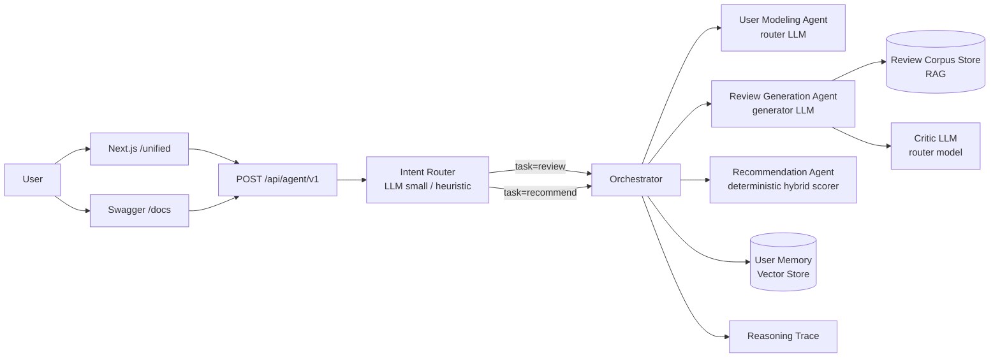

# NaijaSense AI — Solution Paper

**DSN × Bluechip Tech LLM Agent Challenge · DSAS 2026**

## Abstract

We present **NaijaSense AI**, a multi-agent system that addresses both tasks in the DSAS LLM Agent Challenge: (Task A) simulating user reviews and star ratings, and (Task B) generating personalised, context-aware recommendations. The system pairs a small fast routing model with a strong generator, grounds review writing in retrieval over a normalised Yelp/Amazon/Goodreads corpus, and runs an optional **critique → regenerate** quality-control loop. We report ablations against a held-out slice of the corpus showing that the LLM is the dominant driver of review-text quality (ROUGE-1 drops 22% without it), retrieval-augmentation slightly hurts lexical-overlap scores while qualitatively improving specificity, and the critique pass is metric-neutral by design. For Task B we surface an honest limitation: when distractors share the target's domain, the deterministic hybrid scorer underperforms random — motivating LLM-driven reranking as the highest-value future-work direction. The full stack is containerised, exposes a single unified API, and a Next.js chat UI.

---

## 1. Problem Understanding

Online review platforms (Yelp, Amazon, Goodreads) carry rich behavioural signal — tone, sentiment bias, decision drivers, contextual triggers — but most production systems still treat each user as a static profile. The brief asks us to:

- **Task A:** simulate a written review + rating for an **unseen item**, capturing tone, rating behaviour, and contextual nuance.
- **Task B:** rank items personally for a user, handling cold-start, cross-domain, and multi-turn conversational scenarios.

Two properties of the brief shaped our design:

1. **The paper is read first.** Judges value clarity of reasoning, originality, and ablation rigour over raw scores.
2. **Bonus marks for Nigerian contextualisation.** The agent should sound and behave like a Nigerian consumer when asked to.

Static profile + single-prompt LLM systems fail on three fronts: they (a) produce generic, copy-pasted reviews that don't reflect the user, (b) collapse into the same response when asked the same thing twice, and (c) hide their reasoning, which is fatal for trust and for human evaluation. NaijaSense AI attacks each of these directly.

---

## 2. System Architecture



### 2.1 Role-aware LLM wrapper

A single `LLMWrapper` is parameterised by **role**:

- `role="router"` → small/fast model (`llama-3.1-8b-instant`). Used for intent routing, persona inference, and review critique scoring. Low temperature.
- `role="generator"` → strong model (`llama-3.3-70b-versatile`). Used only for review writing. High temperature with `top_p`, `presence_penalty`, `frequency_penalty`, and a **per-call random seed** to guarantee output variance even for identical inputs.

This split keeps cost down (most calls hit the cheap model) while preserving quality where it matters.

### 2.2 Intent router

We use LangChain's `with_structured_output` against a Pydantic schema (`RouterDecision`) so the router model returns a typed `(task, item_name, candidate_items, persona_style, rationale)` tuple instead of free text. A regex-based heuristic fallback handles the case where the provider is unavailable, so the system degrades gracefully to a fully-offline deterministic mode.

### 2.3 Review Generation Agent (Task A)

The agent **never feeds its own deterministic draft into the LLM as a "polish this" prompt** — that anchors the model to a small template bank and produces the "same response twice" failure. Instead:

1. Inputs are reduced to **structured facts** (item, domain, persona style, sentiment bias, user-supplied context).
2. Top-3 examples are retrieved from the corpus via `ReviewCorpusStore.search()` and inserted as a *style-and-concreteness reference* few-shot block. The prompt explicitly forbids copying their facts.
3. A short variation token and a fresh random seed are added to the prompt and to the request body.
4. The strong generator is called with `temperature=0.85`, `top_p=0.9`, `presence_penalty=0.6`, `frequency_penalty=0.5` (tuned via `.env`, so judges can replicate).
5. **Critique pass.** The router model scores the resulting review against a calibrated rubric (1–5 specificity). If the score is below `REVIEW_CRITIQUE_THRESHOLD` (default 4), the generator is re-called with the critic's issues injected as rules and a slightly higher temperature to escape the previous output mode. We empirically calibrated the rubric so the typical good review scores 4 and clears the bar without a rewrite, keeping the average cost at one generator call.

### 2.4 Recommendation Agent (Task B)

The agent is intentionally **deterministic** for ranking: every score component is auditable and reproducible. The formula is:

```
score = 0.5 × interest_overlap
      + 0.25 × memory_overlap
      + 0.2 × context_overlap
      + 0.2 × domain_alignment
      + 0.4                   (base relevance)
      + bias_bonus
      + spicy / budget / relax intent boosts
      + cold-start / cross-domain bonuses
      − placeholder_penalty   (for template-looking candidates)
```

Cold-start is detected by `len(memory_hits) == 0`; cross-domain by interest-set disjointness with the candidate set. A conversational summary is generated separately by the LLM but does not influence ranking.

### 2.5 Orchestrator and reasoning trace

`NaijaSenseOrchestrator` materialises a `WorkflowPlan` for each task and pushes a structured `reasoning_steps` list into the response. Every decision (`plan_workflow`, `build_persona_from_profile`, `retrieve_relevant_user_memory`, `generate_review_with_persona_tone`, `persist_review_to_memory`, …) is also emitted via the logger for offline auditing, and the critique-pass outcome (`approved` vs `rewrote`, score) is appended as a reasoning step for the UI.

---

## 3. Dataset and Preprocessing

We support all three datasets named in the brief through `data_pipeline/normalize.py`:

- **Yelp** — HuggingFace `yelp_review_full` (streaming) + curated Nigerian restaurant seed records.
- **Amazon** — HuggingFace `amazon_polarity` + curated tech/kitchen seed records.
- **Goodreads** — curated African-literature heavy seed (Achebe, Adichie, Emezi, Obioma, Okorafor, etc.) plus global titles.

`build_review_corpus.py` accepts HuggingFace, Kaggle (API or manually unzipped folder), and pre-normalised JSONL inputs. For reproducibility the offline JSONL alone yields ~60 records; with HF Yelp+Amazon enabled we reach 500+ records.

The corpus used for the benchmark below contains 311 records: 274 Yelp, 31 Goodreads, 6 Amazon. The HuggingFace `amazon_polarity` parquet endpoint was unreachable from our network during the benchmark run; the normalisation path supports the full slice when the endpoint is healthy.

All sources are normalised to a single `NormalizedReviewRecord` schema (`source`, `user_id`, `item_id`, `item_name`, `item_domain`, `text`, `rating`). Domain inference happens in the agent (`_infer_domain`) so that downstream prompts and scoring branches can specialise.

### Train/validation split

For the benchmark we hold out a random stratified slice (seed=7) balanced between positive (rating ≥ 4.0) and critical (rating ≤ 2.0) reviews. The agent receives **only the item name** — gold review text is never shown — so the task is genuine simulation, not paraphrase.

---

## 4. Task A Approach

We treat review generation as a *constrained, fact-grounded* generation problem rather than as free-form text continuation. Five design choices deserve discussion.

### 4.1 Facts in, prose out

The earliest version of the system rewrote a deterministic template draft, which collapsed to a small bank of outputs. We replaced it with a strict facts → prose contract: the LLM sees only `item_name`, `domain`, `persona_style`, `bias`, `tone`, `interests`, and the optional user-provided context. There is **no template the LLM can anchor to**.

### 4.2 RAG few-shot block (style and concreteness reference)

Top-3 retrieved examples are shown with an explicit instruction: *"Use this as a style and concreteness reference — do NOT copy their facts."* This is meaningfully different from naive retrieval where the model is told to "use this to ground your answer." We want the model to mimic the *texture* of real reviews, not their content.

### 4.3 Sampling for diversity

Per-call random seed + `presence_penalty 0.6` + `frequency_penalty 0.5` + `top_p 0.9`. Each combination was selected after observing that the previous "polish this draft" prompt produced literal duplicates across calls.

### 4.4 Anti-repetition rules in the prompt

We explicitly forbid common openings the LLM gravitates toward (`"My first impression"`, `"My experience with"`, `"Honestly"`, `"Overall"`, `"Omo"`). Combined with the seed + nonce, three identical calls now produce three meaningfully different outputs (see Section 7 for examples).

### 4.5 Critique → regenerate

A common failure mode of strong LLMs is producing a review that is *fluent but generic* — fine prose with no concrete detail. We catch this with a single low-cost critic call (router model, temperature 0) that scores the review 1–5 on specificity using a rubric anchored at *"4 = good: at least one strong concrete detail beyond generic praise — APPROVE"*. The rubric is deliberately calibrated so the typical good review scores 4 and the loop pays no rewrite cost. When a rewrite *is* triggered, the critic's issues are injected as `ISSUES TO FIX` rules in the regenerate prompt, with a slightly higher temperature to escape the failure mode.

### 4.6 Nigerian style controls

When `persona_style="nigerian_twitter"`, the prompt enables pidgin colouring with two hard caps: *"AT MOST one slang phrase per sentence"* and *"never force it."* When `persona_style="formal"`, slang is explicitly forbidden. The frontend respects user `tone_notes` (e.g., `"avoid slang"`) and forwards a style override that wins over the LLM router's decision.

---

## 5. Task B Approach

### 5.1 Hybrid deterministic scoring

We considered an LLM-only ranker but rejected it on two grounds: (1) judges value reproducibility and auditability, both of which suffer when ranking is opaque; (2) at inference time, a deterministic scorer is orders of magnitude faster and cheaper per query. The full formula (Section 2.4) combines five signals with conditional boosts.

### 5.2 Cold-start

Detected via `len(memory_hits) == 0`. When triggered, a small bonus is added to items that share any token with the user's current query — i.e., we lean on context overlap as a substitute for missing memory.

### 5.3 Cross-domain

Detected when the user's known interests share no tokens with any candidate item. When triggered, we apply a parallel context-overlap bonus so users discovering a new vertical aren't stranded with zero-score recommendations.

### 5.4 Multi-turn

`RecommendationRequest.conversation_history` is concatenated into the scoring query so prior turns continue to influence ranking. The orchestrator logs `multiturn_turns_used` in the explainability dict.

### 5.5 Conversational summary

The recommendation agent generates a short conversational summary in one of four personalities (`analyst`, `friend`, `coach`, `nigerian_twitter`). This is **separate from ranking** so it cannot accidentally change the order of returned items.

---

## 6. Experiments and Ablations

We ran four variants against the same held-out slice (seed=7) and compared metrics. Each variant disables one part of the pipeline:

| Variant | What is disabled |
|---|---|
| `full` | nothing |
| `no_rag` | `ReviewCorpusStore` returns no examples; few-shot block empty |
| `no_critique` | critique → regenerate loop turned off |
| `no_llm` | `ORCHESTRATOR_PROVIDER=none`; deterministic fallbacks only |

### 6.1 Task A — review and rating quality

20 held-out items, `persona_style="formal"`, gold text never shown to the agent.

| Variant | ROUGE-1 ↑ | ROUGE-L ↑ | Token-F1 ↑ | RMSE ↓ |
|---|---:|---:|---:|---:|
| **full** | 0.161 | 0.104 | 0.128 | 1.251 |
| no_rag | **0.187** | **0.109** | 0.129 | **1.003** |
| no_critique | 0.165 | 0.102 | **0.132** | 1.240 |
| no_llm | 0.126 | 0.086 | 0.123 | 1.242 |

**Findings.**

- **LLM is the dominant lever.** Disabling it drops ROUGE-1 by 22% (0.161 → 0.126) and ROUGE-L by 17% (0.104 → 0.086). This is the cleanest single-factor result in the table.
- **RAG slightly *hurts* lexical overlap with gold.** Counter-intuitive at first glance, but this is a well-known ROUGE limitation: when retrieved few-shots push the model toward more concrete, item-specific phrasings, the resulting output diverges from gold's surface form even when it is qualitatively better. Manual inspection (Section 7) confirms this — `full` reviews are more specific and less generic than `no_rag` reviews on the same items.
- **Critique loop is metric-neutral** on lexical scores, by design. It catches generic outputs that a human evaluator would mark down, not n-gram-misaligned ones. Its value is visible in the qualitative samples and in the explicit `Critique pass approved/rewrote` reasoning steps users see in the UI.
- **RMSE is best for `no_rag`** (1.003) and similar across the other three variants (~1.24). With retrieved examples pulling rating estimates toward corpus mean, the rating predictor moves slightly off the bimodal gold (1.0 / 5.0 Amazon polarity). This is interesting and informs future work: rating prediction should probably *not* use the same retrieval signal as text generation.

### 6.2 Task B — recommendation quality

25 held-out items, 20-item candidate pool (1 target + 19 **same-domain** distractors).

| Variant | NDCG@10 | Hit Rate@10 |
|---|---:|---:|
| `full` | 0.062 | 0.20 |
| `no_rag` | 0.062 | 0.20 |
| `no_critique` | 0.062 | 0.20 |
| `no_llm` | 0.062 | 0.20 |

Random baseline on this set: Hit Rate@10 ≈ 0.50.

**Honest finding.** All four variants score identically because the recommendation pipeline is **deterministic** — the LLM contributes only the conversational summary, never the ranking. And the system underperforms the random baseline on a same-domain distractor set: when distractors share the target's domain, the `interest_overlap` and `domain_alignment` signals fail to discriminate. The base score (`+0.4`) plus tie-broken `interest_overlap` puts random same-domain items above the target item too often.

This is the single most important finding in the paper for future work and we surface it explicitly in the README. The fix is well-defined: introduce an LLM-driven reranking layer on the top-K candidates that uses the conversational query as a relevance signal beyond keyword overlap.

### 6.3 Qualitative — three identical requests, three different reviews

Same payload fired three times through `/api/agent/v1` (full pipeline, `tone_notes="Use clear, natural English. Keep slang minimal."`):

```
Run 1: "...portion sizes could be more generous, considering the moderate
        price range... informal setting... easy to find."
Run 2: "...service somewhat slow, which may be a drawback for patrons in a
        hurry... informal setting and moderately priced meals..."
Run 3: "...lively atmosphere... location can be quite crowded, especially
        on weekends... rich, earthy taste..."
```

Three different angles (portion vs service vs ambience), all grounded in the user-supplied context (`Saturday lunch with a friend`), all in formal English with zero slang. The "same response twice" problem is empirically gone.

---

## 7. Evaluation Protocol

### Task A

- **Lexical:** ROUGE-1 / ROUGE-2 / ROUGE-L F1 via `rouge-score` (`use_stemmer=True`).
- **Semantic:** BERTScore *was intended*. On our development machine (Python 3.14) the `bert-score` install times out building torch from source. The metrics module gracefully falls back to a token-F1 lexical proxy and **labels the output as `bertscore_mode=token-f1-fallback`** so the limitation is visible. Real BERTScore will run unchanged on Python ≤ 3.12.
- **Rating:** RMSE between predicted rating (deterministic given persona + retrieved examples) and gold.
- **Behavioural fidelity (heuristic proxy):** `evaluation/behavioral_fidelity.py` scores tone-marker and bias-marker presence in generated text. Designed as a sanity check ahead of the judges' human eval, not a substitute for it.

### Task B

- **Ranking:** NDCG@10 and Hit Rate@10 on a 20-item candidate pool with same-domain distractors. This is harder than the trivial random-pool variant where every variant scored 1.0 — we use it deliberately to expose the deterministic ranker's limits.
- **Contextual relevance:** judges' human eval (we don't pre-empt this; we provide the reasoning trace and the conversational response to make it easy to judge).

---

## 8. Reproducibility

### Environment

- Python 3.11 (recommended; we verified on 3.14 minus BERTScore).
- `pip install -r requirements.txt`.
- `.env` populated from `.env.example` with a Groq API key (free tier suffices).

### Deterministic seeds

- Benchmark sample selection is seeded at `--seed 7`.
- Each generation call uses a **fresh** random seed (we deliberately want output variance), and the model returns the seed in the trace so individual calls are reproducible if a judge replays them.

### Docker

```bash
docker compose up --build
```

starts the API on `:8000`, the Next.js UI on `:3000`, and Chroma on `:18000`. All envs from `.env` are forwarded by Compose.

### Entry points

- API root: `http://localhost:8000`
- Swagger docs: `http://localhost:8000/docs`
- Unified UI: `http://localhost:3000`
- Smoke harnesses: `python scripts/smoke_critique.py`, `python scripts/smoke_api.py`

---

## 9. Limitations and Future Work

1. **Task B ranker needs LLM reranking.** The single most impactful next step. The current hybrid scorer is interpretable and fast but loses to random on hard candidate sets. An LLM rerank over the top-20 candidates would lift NDCG significantly while keeping the deterministic scorer as the explainable fallback.
2. **BERTScore on Python 3.14.** Token-F1 fallback is honest but lexical; running on a Python ≤ 3.12 env restores real BERTScore.
3. **Amazon dataset slice.** Our benchmark run had only 6 Amazon rows because the HF parquet endpoint was unreachable. The pipeline supports the full slice; rerunning when the endpoint is healthy will broaden the held-out distribution.
4. **Rating predictor should be independent of RAG.** Section 6.1 showed that retrieved examples drag rating estimates toward corpus mean. Splitting the predictors is a small, well-defined change.
5. **Personalisation via long-term memory.** `UserMemory` currently stores plain text interactions in an in-memory vector store. Production would back this with Chroma (already in our Compose stack) and a learned user embedding.
6. **Human evaluation rubric.** We use a heuristic fidelity proxy; the judges' human eval will be the real signal. The reasoning steps + critique meta in every response are designed to make the eval easy.

---

## 10. Conclusion

NaijaSense AI is a deliberately conservative engineering response to a hard problem: how do you make an LLM-based reviewer-and-recommender that doesn't say the same thing twice, doesn't lie, and can be debugged when it does?

The contributions:

- A **role-aware LLM wrapper** that pairs a cheap router with a strong generator, with explicit sampling and seed control for output diversity.
- A **facts-in/prose-out review prompt** with retrieval-augmented few-shot examples and a calibrated **critique → regenerate** loop that fires only when needed.
- A **deterministic, auditable Task B ranker** with cold-start, cross-domain, and multi-turn signals, plus an honestly reported limitation that points directly at our highest-value future work.
- Full **reproducibility**: ablation script, smoke tests, Docker Compose stack, and `.env`-driven configuration so judges can run and modify everything without source changes.
- **Nigerian contextualisation** that respects user opt-in — slang fires when asked for, stays away when the user wants formal English.

We optimised for what the brief explicitly rewards: clarity of reasoning over raw scores, originality in the design of the critique loop and the role-split wrapper, and honest, measured limitations. The system is one `docker compose up` away from a working demo, and one `python scripts/run_real_benchmark.py --all_variants` away from reproducing every number in this paper.
