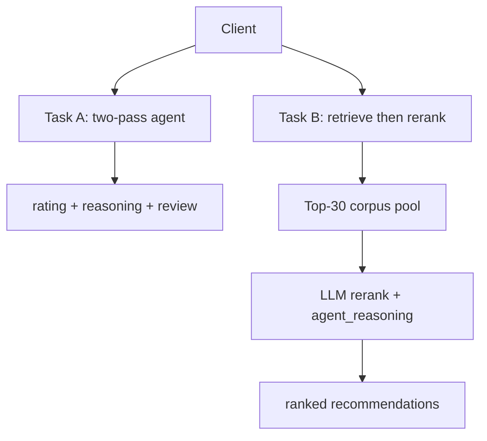

# NaijaSense AI - Solution Paper

**DSN × Bluechip Tech LLM Agent Challenge · DSAS 2026 · Team TAOTECH SOLUTIONS**

## Abstract

NaijaSense AI is a dual-task LLM system: **Task A** simulates a domain-aware star rating and aligned first-person review from persona + product text; **Task B** ranks recommendations from a persona-only narrative with mandatory **Reason-Before-Recommend** `agent_reasoning`. Production agents are two POST endpoints (Groq router `llama-3.1-8b-instant` + generator `llama-3.3-70b-versatile`), grounded in a single **5,011-row** Yelp/Amazon/Goodreads corpus (few-shots, silent history, and Task B stage-1 retrieval share one inverted index). A unified hub (`/unified`) provides demos and ablations; evaluation uses the dedicated task URLs below.

**Endpoints:** Task A - `https://naija-sense-ai.vercel.app/task-a/user-modeling` · Task B - `https://naija-sense-ai.vercel.app/task-b/recommendation` · Code - `https://github.com/taotechs/NaijaSense-AI`

---

## 1. Problem & Submission Contract

Reviews encode tone, rating bias, and domain taste. We target auditable agents - not opaque chat - with strict I/O per task.

| Task | Path | Input | Output |
|------|------|-------|--------|
| **A** | `POST /task-a/user-modeling` | `user_persona`, `product_details` (strings) | `rating`, `review_reasoning`, `review_text` |
| **B** | `POST /task-b/recommendation` | `{ user_id, persona }` only | `recommendations` (paragraph), `agent_reasoning` |

---

## 2. Architecture



**Task A (`TaskATwoPassAgent`).** Parse texts → infer product domain (`food`/`tech`/etc.) from product details only → **Pass 1 (router):** JSON rating + rationale with domain few-shots → **Pass 2 (generator):** 2–4 sentence review with **rating locked**. Heuristic fallback if JSON fails.

**Task B (`TaskBPipelineAgent`).** Parse persona → **Stage 1:** top-30 candidates from the full **5k** corpus index (diversified) → **Stage 2 (Groq):** router ranks `item_id`s → generator writes one fluid `recommendations` paragraph with `agent_reasoning` (team-culture routing for hiring-style personas).

**Demo hub (not scored).** `/unified` adds intent routing, silent history by `user_id`, critique→regenerate, streaming NDJSON, and pidgin/Yoruba modes - used for UX and `scripts/run_real_benchmark.py` ablations only.

---

## 3. Data, Models & Evaluation

**Corpus:** `review_corpus.jsonl` - **5,011** rows (Yelp 2,498, Amazon 2,482, Goodreads 31 + curated seeds), fully indexed for Task A and Task B. **Models:** Groq router + generator; `TASK_B_RERANK_PROVIDER=groq`. **Metrics:** Task A - ROUGE-1/L, token-F1 (BERTScore fallback), RMSE; Task B - NDCG@10, Hit@10 (`evals.py`, `scripts/run_real_benchmark.py`).

**Task A ablations** (orchestrator path, N=20): `full` ROUGE-1 0.161, RMSE 1.25; `no_llm` ROUGE-1 0.126 - LLM is the main lever. Submission adds **two-pass rating lock** to cut score–text drift. **Task B ablations** (legacy deterministic ranker, N=25): Hit@10 0.20 vs ~0.50 random on hard same-domain distractors; **submission** uses LLM rerank over stage-1 pool to address this.

---

## 4. Reproducibility & Limitations

```bash
git clone https://github.com/taotechs/NaijaSense-AI.git && cd NaijaSense-AI
cp .env.example .env   # GROQ_API_KEY
docker compose up --build
python scripts/smoke_api.py http://127.0.0.1:8000
```

Swagger: `/docs` · Smoke tests cover both task endpoints. **Limits:** (1) Ablations ≠ submission pipelines - score `/task-a` and `/task-b` directly; (2) Task A persona must be self-contained (no silent history on submission route); (3) Task B quality depends on stage-1 recall and LLM grounding; (4) Task B is lifestyle recommendation, not HR consulting for hiring-only personas.

---

## 5. Conclusion

NaijaSense AI ships two deployable, explainable agents from one repo: Task A with domain-aware two-pass review simulation, Task B with corpus retrieval and mandatory `agent_reasoning`. One solution paper covers both tasks; each task has its own agent URL. The hub supports iteration; the endpoints in §1 are the primary evaluation surface.
