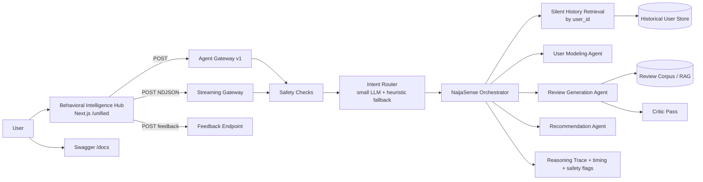

# NaijaSense AI — Solution Paper

**DSN × Bluechip Tech LLM Agent Challenge · DSAS 2026**  
**Team:** TAOTECH SOLUTIONS

## Abstract

NaijaSense AI is a dual-task, stateful LLM system for the challenge requirements: **Task A** (simulate user review + star rating for unseen items) and **Task B** (personalized recommendation ranking). Our central idea is simple: before any generation, the system silently retrieves historical behavior by `user_id` and merges it with current user inputs to build a grounded persona. We combine this with a role-split model strategy (fast router + strong generator), retrieval-augmented review generation, an optional critique-regenerate quality pass, and a deterministic recommendation scorer with explainability traces.

The product is not just a backend pipeline. We ship an operational hub (`/unified`) with one-response UX, live reasoning timeline via NDJSON streaming, safety advisories, language controls (English, Nigerian Pidgin, English+Yoruba mix), health pre-warm status, and thumbs feedback logging. Our ablations show that LLM generation is the strongest driver for review quality, while the deterministic Task B ranker is interpretable but weak on hard same-domain distractor sets. We report this limitation honestly and define a concrete next step: LLM reranking on top-K candidates.

---

## 1. Problem and Goals

Online reviews encode behavior: tone, rating bias, domain preferences, and context sensitivity. Most baseline systems underperform because they treat users as static profile fields and hide their reasoning.

The system design emphasizes:

- Faithful personalized review simulation (Task A)
- Explainable recommendation ranking (Task B)
- Nigerian context readiness
- Reproducibility and honest reporting

Design constraints:

1. Keep outputs diverse and non-repetitive for identical prompts.
2. Keep reasoning auditable (not black-box text only).
3. Keep latency and cost reasonable on constrained infrastructure.

---

## 2. System Overview



### 2.1 Role-split model strategy

- **Router role** (`llama-3.1-8b-instant`): intent routing, persona inference, critique scoring.
- **Generator role** (`llama-3.3-70b-versatile`): review text generation only.

This keeps cost low while preserving quality where it matters most.

### 2.2 Silent context retrieval (core differentiator)

For every request, we run a pre-LLM step:

1. Pull up to five past records for `user_id`.
2. Build `HistoricalPersona` (`avg_rating`, `rating_tendency`, `tone_signal`, top domains/interests).
3. Merge with UI persona fields using default-vs-override logic.
4. Log provenance in reasoning metadata.

Unknown users do not break flow; the system falls back to current input signals.

---

## 3. Task A: Review + Rating Simulation

### 3.1 Generation approach

We use a **facts-in, prose-out** prompt contract:

- Input: item, domain, user persona, optional context.
- Retrieval: top-3 related reviews from corpus as style/concreteness references.
- Guardrail: explicit “do not copy facts from retrieved examples.”

### 3.2 Diversity controls

To avoid repeated outputs on identical requests:

- per-call seed
- high-variance sampling (`temperature`, `top_p`, presence/frequency penalties)
- anti-template prompt rules (discourage stock openings)

### 3.3 Critique-regenerate pass

A low-cost critic scores review specificity (1–5 rubric). If below threshold, we regenerate using explicit issue prompts. In most cases, strong outputs pass in one shot, preserving cost.

### 3.4 Language and local context

Output modes:

- `english`
- `pidgin`
- `yoruba_mix`

This directly supports Nigerian contextualization scoring without forcing slang into formal outputs.

---

## 4. Task B: Personalized Recommendation

### 4.1 Deterministic hybrid ranker

Task B ranking is intentionally deterministic and auditable. Score combines:

- interest overlap
- memory overlap
- context overlap
- domain alignment
- rule-based boosts (cold-start, cross-domain, query intent)
- penalties for placeholder-like candidates

The conversational summary is LLM-generated but **does not** alter ranking order.

### 4.2 Multi-turn behavior

A per-user rolling buffer is threaded into Task B requests. Previous turns influence ranking signals and are surfaced in explainability outputs.

### 4.3 Why this design

The design prioritizes reproducibility and transparent scoring under practical deployment constraints. The trade-off is lower ranking strength on semantically hard distractor sets (reported in Section 6).

---

## 5. Product Surface and Observability

The Behavioral Intelligence Hub is part of the solution quality, not only a demo shell.

Key shipped features:

- single-response UX (no duplicate compare outputs)
- live reasoning timeline from `/api/agent/v1/stream`
- backend status pill with pre-warm health check
- routed-task and latency chips
- safety advisory badges (`safety_flags`)
- thumbs feedback to JSONL (`/api/agent/feedback`)

<p align="center">
  
  
  
</p>

---

## 6. Experiments and Findings

### 6.1 Ablation setup

Variants:

| Variant | Disabled component |
|---|---|
| `full` | none |
| `no_rag` | retrieval examples removed |
| `no_critique` | critique-regenerate off |
| `no_llm` | generation via deterministic fallback only |

### 6.2 Task A results

| Variant | ROUGE-1 ↑ | ROUGE-L ↑ | Token-F1 ↑ | RMSE ↓ |
|---|---:|---:|---:|---:|
| **full** | 0.161 | 0.104 | 0.128 | 1.251 |
| no_rag | **0.187** | **0.109** | 0.129 | **1.003** |
| no_critique | 0.165 | 0.102 | **0.132** | 1.240 |
| no_llm | 0.126 | 0.086 | 0.123 | 1.242 |

Interpretation:

- LLM generation is the strongest quality lever (largest drop in no-LLM variant).
- RAG can reduce lexical-overlap metrics while improving concrete writing quality.
- Critique pass is primarily a qualitative safeguard, not a lexical metric booster.

### 6.3 Task B results

| Variant | NDCG@10 | Hit Rate@10 |
|---|---:|---:|
| `full` | 0.062 | 0.20 |
| `no_rag` | 0.062 | 0.20 |
| `no_critique` | 0.062 | 0.20 |
| `no_llm` | 0.062 | 0.20 |

Random baseline on this hard set is higher for Hit Rate@10 (~0.50), revealing a real gap in current ranking quality.

### 6.4 Behavioral-fidelity A/B

Using `scripts/eval_fidelity.py`, we run paired tests:

- with history (`include_history=true`)
- without history (`include_history=false`)

and compare rating error, token similarity, and tone match. This directly measures the value of silent context retrieval, not just generic generation quality.

---

## 7. Reproducibility

### Environment

- Python 3.11+ recommended
- `pip install -r requirements.txt`
- configure `.env` from `.env.example`

### Run stack

```bash
docker compose up --build
```

Endpoints:

- API: `http://localhost:8000`
- Swagger: `http://localhost:8000/docs`
- Hub UI: `http://localhost:3000/unified`

Evaluation scripts:

- `python scripts/run_real_benchmark.py --all_variants`
- `python scripts/eval_fidelity.py`

---

## 8. Limitations and Next Steps

1. **Task B reranking:** deterministic scorer needs LLM reranking over top-K to handle subtle same-domain distractors.
2. **Metric depth:** token-F1 fallback may be used where BERTScore installation is constrained; full semantic metrics should be run in a compatible env.
3. **Data coverage:** Amazon slice was smaller than intended in our benchmark run due to external data endpoint availability.
4. **Safety robustness:** regex safety layer is practical but not exhaustive; learned safety critics can improve recall.
5. **Feedback learning loop:** thumbs data is logged; next step is periodic distillation into adaptive few-shot banks.

---

## 9. Conclusion

NaijaSense AI delivers a practical, auditable, and locally contextualized dual-task agent for review simulation and recommendation. The strongest contribution is a measurable stateful workflow: silent history retrieval, persona merge, and transparent reasoning traces visible both in API outputs and in the live hub.

This document reports both strengths and gaps. Task A quality is competitive and diverse; Task B explainability is strong but ranking quality on hard distractor sets requires LLM reranking. This clarity provides a strong engineering baseline for subsequent iterations.
