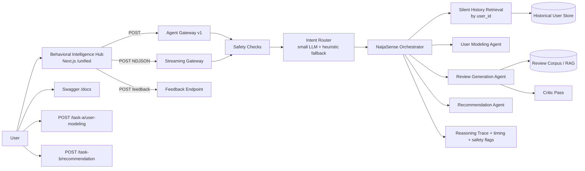

# NaijaSense AI — Solution Paper

**DSN × Bluechip Tech LLM Agent Challenge · DSAS 2026**  
**Team:** TAOTECH SOLUTIONS

## Abstract

NaijaSense AI is a dual-task, stateful LLM system for **Task A** (review + rating simulation) and **Task B** (personalized recommendation ranking). The core differentiator is silent history retrieval by `user_id` before generation, followed by persona merge with current user inputs. The stack combines a role-split model strategy (fast router + strong generator), retrieval-augmented review generation, optional critique-regenerate quality control, and a deterministic recommendation scorer with explainability traces.

The system ships with a production-style hub (`/unified`) that includes single-response UX, live NDJSON reasoning timeline, safety advisories, language control (English/Pidgin/Yoruba mix), health pre-warm status, and thumbs feedback logging. Results show LLM generation is the strongest quality lever for Task A, while Task B ranking remains interpretable but weak on hard same-domain distractors; the next step is LLM reranking on top-K candidates.

---

## 1. Problem and Goals

Online reviews encode behavior: tone, rating bias, domain preferences, and context sensitivity. Most baseline systems underperform because they treat users as static profile fields and hide their reasoning.

The system design emphasizes:

- Faithful personalized review simulation (Task A)
- Explainable recommendation ranking (Task B)
- Nigerian context readiness
- Reproducibility and honest reporting

Design constraints: output diversity, reasoning transparency, and low-latency/low-cost deployment.

---

## 2. System Overview

### 2.0 Dual-link submission architecture

Judges require **two separate review URLs**. NaijaSense exposes dedicated, judge-friendly endpoints (no unified routing required):

| Task | Endpoint | Input | Output |
|------|----------|-------|--------|
| A — User modeling | `POST /task-a/user-modeling` | `user_persona` + `product_details` | `rating` + `review` |
| B — Recommendation | `POST /task-b/recommendation` | `user_persona` | ranked `recommendations` + `chain_of_thought` |

The API root (`GET /`) serves an HTML landing page linking both endpoints. The Next.js home page mirrors the same links for Vercel deploys. Legacy routes (`/api/v1/*`, `/api/agent/v1`) remain for demos and ablations.

**Why separate endpoints?** The hackathon form expects straightforward I/O per task. Splitting surfaces makes agentic reasoning auditable: Task A optimises Nigerian review fidelity; Task B runs an explicit **Reason-Before-Recommend** chain (persona scan → context → rank) before scoring candidates. Cold-start and cross-domain cases use Nigerian default interests and a curated cross-domain catalog (`core/nigerian_defaults.py`, `evals.py`).



### 2.1 Role-split model strategy

- **Router role** (`llama-3.1-8b-instant`): intent routing, persona inference, critique scoring.
- **Generator role** (`llama-3.3-70b-versatile`): review text generation only.

This keeps cost low while preserving quality where it matters most.

### 2.2 Silent context retrieval (core differentiator)

For every request, the system runs a pre-LLM step:

1. Pull up to five past records for `user_id`.
2. Build `HistoricalPersona` (`avg_rating`, `rating_tendency`, `tone_signal`, top domains/interests).
3. Merge with UI persona fields using default-vs-override logic.
4. Log provenance in reasoning metadata.

Unknown users fall back to current input signals.

---

## 3. Task A: Review + Rating Simulation

### 3.1 Generation approach

We use a **facts-in, prose-out** prompt contract:

- Input: item, domain, user persona, optional context.
- Retrieval: top-3 related reviews from corpus as style/concreteness references.
- Guardrail: explicit “do not copy facts from retrieved examples.”

### 3.2 Diversity controls

To avoid repeated outputs on identical requests, generation uses per-call seed, tuned sampling (`temperature`, `top_p`, presence/frequency penalties), and anti-template prompt rules.

### 3.3 Critique-regenerate pass

A low-cost critic scores review specificity (1-5 rubric). If below threshold, the system regenerates with explicit issue prompts. Most outputs pass in one shot, keeping cost low.

### 3.4 Language and local context

Output modes:

- `english`
- `pidgin`
- `yoruba_mix`

This supports local contextualization without forcing slang into formal outputs.

---

## 4. Task B: Personalized Recommendation

### 4.1 Deterministic hybrid ranker

Task B ranking is intentionally deterministic and auditable. Score combines:

- interest overlap
- memory overlap
- context overlap
- domain alignment
- rule-based boosts (cold-start, cross-domain, query intent)
- penalties for placeholder-like candidates

The conversational summary is LLM-generated but **does not** alter ranking order.

### 4.2 Multi-turn behavior

A per-user rolling buffer is threaded into Task B requests. Previous turns influence ranking signals and are surfaced in explainability outputs.

---

## 5. Product Surface and Observability

The Behavioral Intelligence Hub is part of the solution quality, not only a demo shell.

Key shipped features:

- Single-response UX (no duplicate compare outputs)
- Live reasoning timeline from `/api/agent/v1/stream`
- Backend status pill with pre-warm health check
- Routed-task and latency chips
- Safety advisory badges (`safety_flags`)
- Thumbs feedback to JSONL (`/api/agent/feedback`)

<p align="center">
  
</p>

**Figure 1. Home screen** (`homescreen.png`): initial view shown after opening [https://naija-sense-ai.vercel.app/](https://naija-sense-ai.vercel.app/), including quick prompts, language selector, and status indicator.

<p align="center">
  
</p>

**Figure 2. Input workflow** (`input.png`): the interaction step where the user enters query, persona context, and language before submitting to the gateway.

<p align="center">
  
</p>

**Figure 3. Output view** (`output.png`): result card after inference, showing routed task, generated content, safety advisories, and reasoning trace.

The UI flow is: **Figure 1 (entry)** -> **Figure 2 (input)** -> **Figure 3 (output)**.

---

## 6. Experiments and Findings

### 6.1 Ablation setup

Variants:

| Variant | Disabled component |
|---|---|
| `full` | none |
| `no_rag` | retrieval examples removed |
| `no_critique` | critique-regenerate off |
| `no_llm` | generation via deterministic fallback only |

### 6.2 Task A results

| Variant | ROUGE-1 ↑ | ROUGE-L ↑ | Token-F1 ↑ | RMSE ↓ |
|---|---:|---:|---:|---:|
| **full** | 0.161 | 0.104 | 0.128 | 1.251 |
| no_rag | **0.187** | **0.109** | 0.129 | **1.003** |
| no_critique | 0.165 | 0.102 | **0.132** | 1.240 |
| no_llm | 0.126 | 0.086 | 0.123 | 1.242 |

Interpretation: LLM generation is the strongest quality lever (largest drop in `no_llm`), RAG can lower lexical overlap while improving concreteness, and critique mainly improves qualitative quality.

### 6.3 Task B results

| Variant | NDCG@10 | Hit Rate@10 |
|---|---:|---:|
| `full` | 0.062 | 0.20 |
| `no_rag` | 0.062 | 0.20 |
| `no_critique` | 0.062 | 0.20 |
| `no_llm` | 0.062 | 0.20 |

Random baseline on this hard set is higher for Hit Rate@10 (~0.50), revealing a ranking gap.

### 6.4 Behavioral-fidelity A/B

`scripts/eval_fidelity.py` runs paired tests with and without history (`include_history=true/false`) and compares rating error, token similarity, and tone match. This isolates the contribution of silent context retrieval.

---

## 7. Reproducibility

Environment: Python 3.11+, `pip install -r requirements.txt`, and `.env` from `.env.example`.

Run stack:

```bash
docker compose up --build
```

Core endpoints: `http://localhost:8000` (API), `http://localhost:8000/docs` (Swagger), `http://localhost:3000/unified` (Hub UI).  
Evaluation: `python scripts/run_real_benchmark.py --all_variants` and `python scripts/eval_fidelity.py`.

---

## 8. Limitations and Next Steps

1. **Task B reranking:** deterministic scorer needs LLM reranking over top-K to handle subtle same-domain distractors.
2. **Metric depth:** token-F1 fallback may be used where BERTScore installation is constrained; full semantic metrics should be run in a compatible env.
3. **Data coverage:** Amazon slice was smaller than intended in our benchmark run due to external data endpoint availability.
4. **Safety robustness:** regex safety layer is practical but not exhaustive; learned safety critics can improve recall.
5. **Feedback learning loop:** thumbs data is logged; next step is periodic distillation into adaptive few-shot banks.

---

## 9. Conclusion

NaijaSense AI delivers a practical, auditable, and locally contextualized dual-task agent for review simulation and recommendation. The strongest contribution is a measurable stateful workflow: silent history retrieval, persona merge, and transparent reasoning traces visible both in API outputs and in the live hub.

Task A quality is competitive and diverse; Task B explainability is strong but ranking on hard distractor sets requires LLM reranking. The system is reproducible, observable, and ready for iterative improvement.
